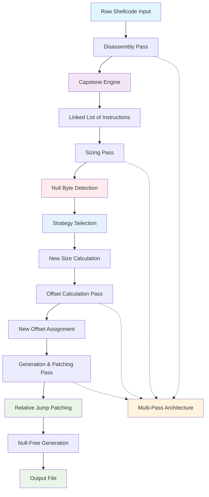

```mermaid
graph TD
    A[Raw Shellcode Input] --> B[Disassembly Pass]
    B --> C[Capstone Engine]
    C --> D[Linked List of Instructions]
    D --> E[Sizing Pass]
    E --> F[Null Byte Detection]
    F --> G[Strategy Selection]
    G --> H[New Size Calculation]
    H --> I[Offset Calculation Pass]
    I --> J[New Offset Assignment]
    J --> K[Generation & Patching Pass]
    K --> L[Relative Jump Patching]
    L --> M[Null-Free Generation]
    M --> N[Output File]
    
    B -.-> O[Multi-Pass Architecture]
    E -.-> O
    I -.-> O
    K -.-> O
    
    style A fill:#e1f5fe
    style N fill:#e8f5e8
    style O fill:#fff3e0
    style C fill:#f3e5f5
    style F fill:#ffebee
    style G fill:#e3f2fd
    style L fill:#e8f5e8
```