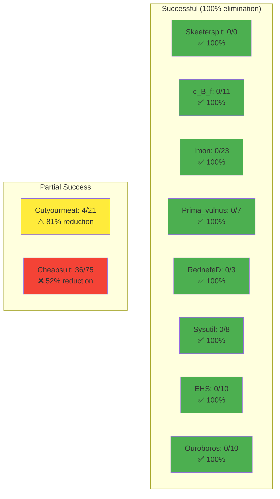

%% Null Byte Reduction Results
%%
%% Visual representation of how many null bytes were eliminated from each test sample
%% Green = 100% success (all nulls removed)
%% Yellow = Partial success (some nulls remain)
%% Red = Lower success rate (many nulls remain)
%%
%% Final Results: 76% reduction overall (168 → 40 nulls)

