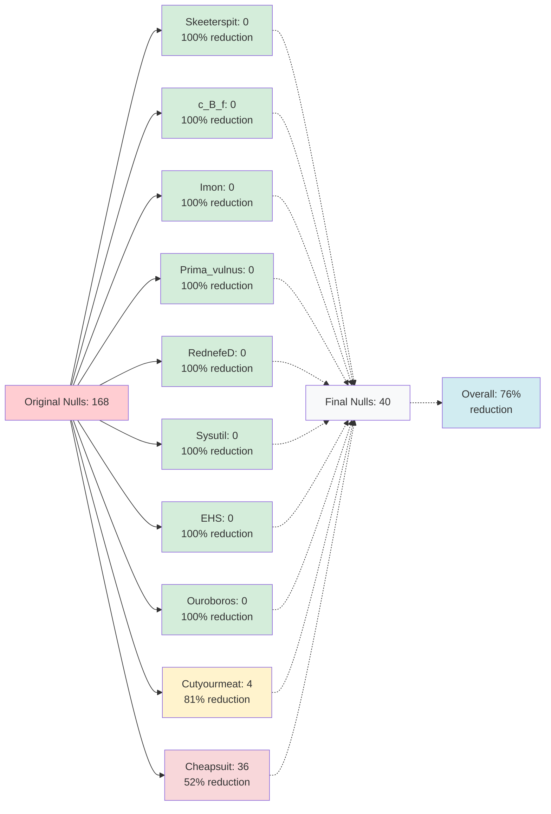

```mermaid
graph LR
    A[Original Nulls: 168] --> B[Skeeterspit: 0<br/>100% reduction]
    A --> C[c_B_f: 0<br/>100% reduction]
    A --> D[Imon: 0<br/>100% reduction]
    A --> E[Prima_vulnus: 0<br/>100% reduction]
    A --> F[RednefeD: 0<br/>100% reduction]
    A --> G[Sysutil: 0<br/>100% reduction]
    A --> H[EHS: 0<br/>100% reduction]
    A --> I[Ouroboros: 0<br/>100% reduction]
    A --> J[Cutyourmeat: 4<br/>81% reduction]
    A --> K[Cheapsuit: 36<br/>52% reduction]

    B -.-> N[Final Nulls: 40]
    C -.-> N
    D -.-> N
    E -.-> N
    F -.-> N
    G -.-> N
    H -.-> N
    I -.-> N
    J -.-> N
    K -.-> N

    N -.-> O[Overall: 76%<br/>reduction]

    style A fill:#ffcdd2
    style N fill:#f8f9fa
    style O fill:#d1ecf1
    style B fill:#d4edda
    style C fill:#d4edda
    style D fill:#d4edda
    style E fill:#d4edda
    style F fill:#d4edda
    style G fill:#d4edda
    style H fill:#d4edda
    style I fill:#d4edda
    style J fill:#fff3cd
    style K fill:#f8d7da
```