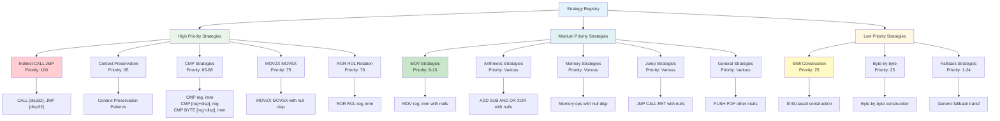

```mermaid
graph TD
    A[Strategy Registry] --> B[High Priority Strategies]
    A --> C[Medium Priority Strategies]
    A --> D[Low Priority Strategies]

    B --> B1[Indirect CALL JMP<br/>Priority: 100]
    B --> B2[Context Preservation<br/>Priority: 95]
    B --> B3[CMP Strategies<br/>Priority: 85-88]
    B --> B4[MOVZX MOVSX<br/>Priority: 75]
    B --> B5[ROR ROL Rotation<br/>Priority: 70]

    C --> C1[MOV Strategies<br/>Priority: 6-13]
    C --> C2[Arithmetic Strategies<br/>Priority: Various]
    C --> C3[Memory Strategies<br/>Priority: Various]
    C --> C4[Jump Strategies<br/>Priority: Various]
    C --> C5[General Strategies<br/>Priority: Various]

    D --> D1[Shift Construction<br/>Priority: 25]
    D --> D2[Byte-by-byte<br/>Priority: 25]
    D --> D3[Fallback Strategies<br/>Priority: 1-24]

    B1 --> B1a["CALL [disp32], JMP [disp32]"]
    B2 --> B2a["Context Preservation Patterns"]
    B3 --> B3a["CMP reg, imm<br/>CMP [reg+disp], reg<br/>CMP BYTE [reg+disp], imm"]
    B4 --> B4a["MOVZX MOVSX with null disp"]
    B5 --> B5a["ROR ROL reg, imm"]

    C1 --> C1a["MOV reg, imm with nulls"]
    C2 --> C2a["ADD SUB AND OR XOR with nulls"]
    C3 --> C3a["Memory ops with null disp"]
    C4 --> C4a["JMP CALL RET with nulls"]
    C5 --> C5a["PUSH POP other instrs"]

    D1 --> D1a["Shift-based construction"]
    D2 --> D2a["Byte-by-byte construction"]
    D3 --> D3a["Generic fallback transf"]

    style A fill:#e3f2fd
    style B fill:#e8f5e8
    style C fill:#e0f2f1
    style D fill:#fff8e1
    style B1 fill:#ffcdd2
    style C1 fill:#c8e6c9
    style D1 fill:#fff9c4
```