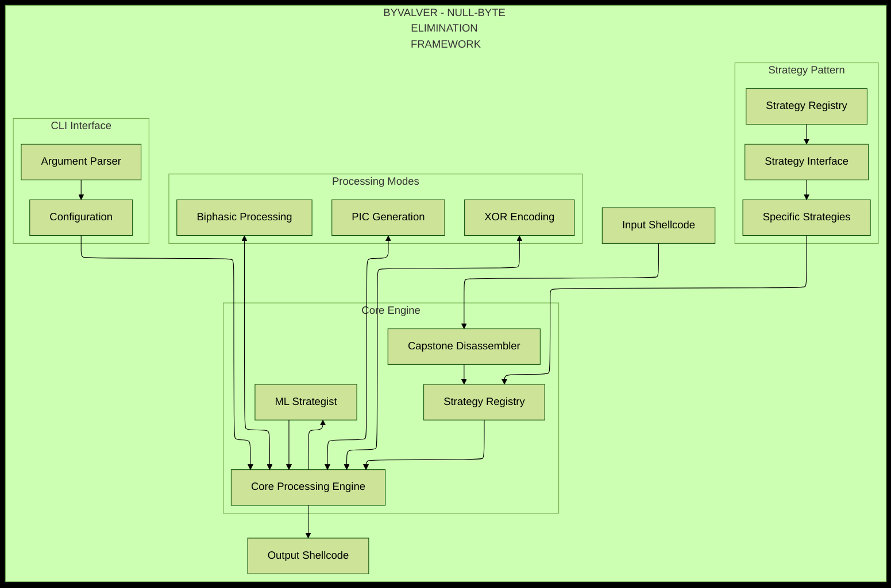
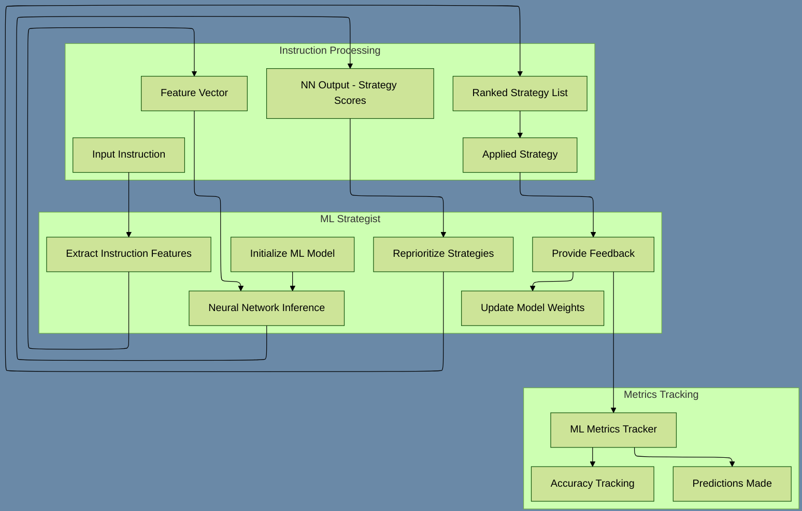

<div align="center">
  <h1>byvalver</h1>
  <p><b>NULL-BYTE ELIMINATION FRAMEWORK</b></p>

  
</div>

<div align="center">

  
  &nbsp;
  
  &nbsp;
  
  &nbsp;
  

</div>

<p align="center">
  <a href="#overview">Overview</a> •
  <a href="#features">Features</a> •
  <a href="#building-and-setup">Setup</a> •
  <a href="#usage-guide">Usage</a> •
  <a href="#architecture">Architecture</a> •
  <a href="#development">Development</a> •
  <a href="#troubleshooting">Troubleshooting</a>
</p>

<hr>

<br>

## OVERVIEW

**byvalver** is a C-based command-line tool designed for automated denulling (removal of null bytes) of shellcode while preserving functional equivalence. The tool leverages the Capstone disassembly framework to analyze x86/x64 assembly instructions and applies a library of ranked transformation strategies to replace null-containing instructions with functionally equivalent, denulled alternatives.

**Primary Function:** Remove null bytes (`\\x00`) from binary shellcode that would otherwise cause issues with string-based operations or memory management routines.

**Technology Stack:**
- C language implementation for performance and low-level control
- Capstone Disassembly Framework for instruction analysis
- NASM assembler for building decoder stubs
- x86/x64 assembly and instruction set knowledge
- Modular strategy pattern for extensible transformations

---

**byvalver**:

1. **ANALYZES** x86/x64 assembly instructions with Capstone
2. **IDENTIFIES** instructions containing null bytes
3. **TRANSFORMS** instructions to null-byte-free equivalents
4. **OUTPUTS** clean shellcode in multiple formats (binary, XOR-encoded, PIC)

`byvalver` tool prioritizes `security`, `robustness`, and `portability`, running seamlessly on Windows, Linux, and macOS.

<br>

## BATCH DIRECTORY PROCESSING

BYVALVER includes comprehensive batch directory processing with full compatibility for all existing options.

### Command-Line Options

- `-r, --recursive` - Process directories recursively
- `--pattern PATTERN` - File pattern to match (default: *.bin)
- `--no-preserve-structure` - Flatten output (don't preserve directory structure)
- `--no-continue-on-error` - Stop processing on first error (default is to continue)

### Auto-Detection

Batch mode is automatically enabled when the input is a directory:

```bash
# Single file mode (automatic)
byvalver input.bin output.bin

# Batch mode (automatic)
byvalver input_dir/ output_dir/
```

### Compatibility with All Existing Options

All options work seamlessly with batch processing:
- `--biphasic` - Applies biphasic processing to all files
- `--pic` - Generates PIC code for all files
- `--ml` - Uses ML strategy selection for all files
- `--xor-encode KEY` - XOR encodes all processed files
- `--metrics, --metrics-json, --metrics-csv` - Aggregates metrics across all files
- `--quiet, --verbose` - Controls output level for batch operations
- `--dry-run` - Validates all files without processing

### Usage Examples

Process all .bin files in a directory (non-recursive):
```bash
byvalver shellcodes/ output/
```

Process recursively with all subdirectories:
```bash
byvalver -r shellcodes/ output/
```

Process only .txt files recursively:
```bash
byvalver -r --pattern "*.txt" input/ output/
```

Process with biphasic mode and XOR encoding:
```bash
byvalver -r --biphasic --xor-encode 0x12345678 input/ output/
```

Flatten output (don't preserve directory structure):
```bash
byvalver -r --no-preserve-structure input/ output/
```

Stop processing on first error (default is to continue):
```bash
byvalver -r --no-continue-on-error input/ output/
```

### Implementation Details

**New Files:**
- `src/batch_processing.h` - Batch processing API
- `src/batch_processing.c` - Directory traversal, file discovery, and statistics

**Key Features:**
- **Automatic directory creation** - Parent directories created automatically (preserves existing functionality)
- **Pattern matching** - Uses fnmatch for flexible file pattern matching
- **Directory structure preservation** - Optional preservation of input directory hierarchy
- **Comprehensive statistics** - Tracks total files, processed, failed, skipped, and size metrics
- **Progress reporting** - Shows progress as [N/Total] filename
- **Error handling** - Configurable error handling (stop or continue on errors)

### Tested Scenarios

✅ Non-recursive batch processing
✅ Recursive batch processing
✅ Directory structure preservation
✅ Flattened output (--no-preserve-structure)
✅ Custom file patterns (--pattern)
✅ Compatibility with --biphasic
✅ Compatibility with --xor-encode
✅ Error handling with --no-continue-on-error
✅ Empty file handling

<br>

## ML PREDICTION TRACKING SYSTEM

BYVALVER includes comprehensive prediction tracking with outcome-based accuracy metrics for the machine learning model.

### Prediction Tracking Architecture

BYVALVER implements a three-component prediction tracking system that enables accurate metrics for ML model performance:

#### 1. **Prediction State Tracking** (`src/ml_strategist.c`)
```c
static strategy_t* g_last_predicted_strategy = NULL;
static double g_last_prediction_confidence = 0.0;
```
Global state variables track the ML model's prediction for each instruction.

#### 2. **Prediction Storage** (`ml_reprioritize_strategies()`)
When the ML model reprioritizes strategies:
- The top-ranked strategy (index 0) is stored as the prediction
- The ML confidence score for that strategy is saved
- Prediction is held in pending state until outcome is known

#### 3. **Outcome-Based Recording** (`ml_provide_feedback()`)
When strategy application completes:
- Compares applied strategy against stored prediction
- Determines if prediction was correct:
  - **Correct**: Predicted strategy was used AND succeeded
  - **Incorrect**: Different strategy used OR predicted strategy failed
- Records prediction with actual outcome via `ml_metrics_record_prediction()`
- Clears prediction state for next instruction

### Implementation Details

**Key Files:**
- `src/ml_strategist.c:39-41` - Prediction state variables
- `src/ml_strategist.c:398-407` - Prediction storage in `ml_reprioritize_strategies()`
- `src/ml_strategist.c:537-562` - Outcome verification and recording in `ml_provide_feedback()`

**How It Works:**
1. Instruction is analyzed and strategies are collected
2. `ml_reprioritize_strategies()` uses neural network to rank strategies
3. Top-ranked strategy and its confidence are stored globally
4. Strategy is applied and result is obtained
5. `ml_provide_feedback()` compares result against prediction
6. Prediction is recorded with correct/incorrect status
7. State is cleared for next instruction

### Metrics Tracking Flow

```
Instruction → ML Inference → Store Prediction → Apply Strategy → Record Outcome
                  ↓                                                    ↓
          (save strategy + confidence)              (correct/incorrect + confidence)
                                                                       ↓
                                                        Update Accuracy Metrics
```

### Example Output

```
=== ML STRATEGIST PERFORMANCE SUMMARY ===
Instructions Processed: 4
Strategies Applied: 4
Null Bytes Eliminated: 4 / 4 (100.00%)

--- Model Performance ---
Predictions Made: 4          ← Predictions now tracked
Current Accuracy: 100.00%    ← Real accuracy metrics
Avg Prediction Confidence: 0.0062  ← Actual confidence values

--- Learning Progress ---
Learning Enabled: YES
Total Feedback Iterations: 8
Positive Feedback: 4
```

### Benefits

- **Accurate Metrics**: Prediction counts reflect actual ML model usage
- **Real Accuracy**: Accuracy percentages based on actual prediction outcomes
- **Confidence Tracking**: Average confidence reflects true ML model confidence scores
- **Learning Validation**: Confirms ML model is making predictions and learning
- **Performance Analysis**: Enables evaluation of ML model effectiveness over time

<br>

## VERIFICATION TOOLS

BYVALVER includes comprehensive verification tools for validating null-byte elimination, functionality preservation, and semantic equivalence of processed shellcode.

### Verification Tools

#### 1. **verify_denulled.py** - Null Byte Elimination Verification
**Purpose**: Verifies that output files contain zero null bytes after processing
**Key Features**:
- Single file or batch directory verification
- Detailed analysis of null byte positions and sequences
- Size change tracking between input and output
- Recursive directory processing support
- Pattern matching for batch operations

**Usage Examples**:
```bash
# Verify single file
python3 verify_denulled.py input.bin

# Verify batch directory (all *.bin files)
python3 verify_denulled.py input_dir/

# Verify specific output file
python3 verify_denulled.py input.bin output.bin

# Batch process with recursion
python3 verify_denulled.py input_dir/ -r --pattern "*.bin"
```

#### 2. **verify_functionality.py** - Basic Functionality Verification
**Purpose**: Verifies that processed shellcode maintains basic functionality patterns
**Key Features**:
- Instruction pattern analysis (MOV, arithmetic, logical, control flow, etc.)
- Architecture-specific analysis (x86/x64 support)
- Shellcode health assessment with pattern preservation metrics
- Batch processing with directory mapping
- Disassembly validation and complexity tracking

**Usage Examples**:
```bash
# Verify single file functionality
python3 verify_functionality.py shellcode.bin

# Batch functionality verification
python3 verify_functionality.py input_dir/

# With architecture specification
python3 verify_functionality.py input_dir/ -r --arch x64
```

#### 3. **verify_semantic.py** - Semantic Equivalence Verification
**Purpose**: Verifies semantic equivalence between original and processed shellcode
**Key Features**:
- Comparative instruction pattern analysis
- Critical pattern preservation monitoring (system calls, control flow, stack operations)
- BYVALVER-aware analysis accounting for null-byte elimination transformations
- Transformation strategy detection (register-to-stack conversion, etc.)
- Batch processing for input/output directory pairs

**Usage Examples**:
```bash
# Verify semantic equivalence of single file pair
python3 verify_semantic.py input.bin output.bin

# Batch semantic verification between directories
python3 verify_semantic.py input_dir/ output_dir/

# Recursive batch verification
python3 verify_semantic.py input_dir/ output_dir/ -r
```

### BYVALVER-Aware Semantic Analysis

The semantic verification tool is specifically designed for the BYVALVER context:

**Critical Patterns (Must Be Preserved)**:
- Control flow instructions (conditional jumps, loops, calls)
- Stack operations (PUSH/POP for function calls)
- System calls (INT 0x80, SYSCALL)

**Expected Transformations (Acceptable Changes)**:
- MOV patterns often change during null-byte elimination
- Arithmetic patterns may be decomposed to avoid nulls
- Logical operations may be substituted (XOR/NOT sequences)
- LEA operations may change for displacement encoding

**Transformation Detection**:
- Register-to-stack conversion for null elimination
- LEA-based displacement encoding strategies
- Logical operation substitution (XOR/AND/OR for null elimination)
- Memory addressing substitution to avoid null displacements

### Batch Processing Capabilities

All verification tools support comprehensive batch processing:

**Common Batch Options**:
- `-r, --recursive`: Process directories recursively
- `--pattern PATTERN`: File pattern matching (default: "*.bin")
- `--continue-on-error`: Continue processing if individual files fail
- `-v, --verbose`: Enable detailed output

**Example Batch Workflow**:
```bash
# Process shellcode directory with byvalver
./bin/byvalver -r --biphasic shellcodes/ processed/

# Verify null-byte elimination in output
python3 verify_denulled.py processed/

# Verify functionality preservation
python3 verify_functionality.py processed/

# Verify semantic equivalence between original and processed
python3 verify_semantic.py shellcodes/ processed/
```

### Performance and Integration

**Verification Performance**:
- Null verification: O(n) - linear scan of shellcode bytes
- Functionality verification: O(n) - single-pass disassembly analysis
- Semantic verification: O(n) - pattern comparison and analysis

**Integration with BYVALVER Pipeline**:
1. Process shellcode with BYVALVER: `./bin/byvalver input.bin output.bin`
2. Verify null elimination: `python3 verify_denulled.py output.bin`
3. Verify functionality: `python3 verify_functionality.py output.bin`
4. Verify semantics: `python3 verify_semantic.py input.bin output.bin`

**Verification Reports**:
- Detailed statistics and analysis for each verification
- Batch summary reports with success/failure rates
- Pattern preservation analysis with specific warnings
- Transformation strategy identification

### Impact Summary
- **Enhanced Quality Assurance**: Automated verification of null-byte elimination results
- **Increased Confidence**: Confirms processed shellcode maintains intended functionality
- **Pipeline Integration**: Full verification pipeline for shellcode processing
- **Batch Processing**: Comprehensive verification of large shellcode collections
- **BYVALVER-Specific Logic**: Verification tools understand null-byte elimination transformations
- **Performance Metrics**: Detailed reports on verification results and success rates

All verification tools are designed to work seamlessly with BYVALVER's null-byte elimination framework, providing confidence in both the elimination of null bytes and the preservation of the shellcode's intended behavior.

<br>

## ARCHITECTURE

BYVALVER follows a modular architecture based on the Strategy pattern, with components designed for extensibility and maintainability. The following diagrams illustrate the key architectural components:

### 1. Overall System Architecture


</div>


</div>

## BUILDING AND SETUP

### DEPENDENCIES

- A C compiler (`gcc`, `clang`, or MSVC)
- [Capstone disassembly library](http://www.capstone-engine.org/) with development headers
- NASM assembler (`nasm`)
- `xxd` utility (usually part of `vim-common` package)
- Make

### INSTALLATION OF DEPENDENCIES

```bash
# Ubuntu/Debian
sudo apt install build-essential nasm xxd pkg-config libcapstone-dev

# macOS with Homebrew
brew install capstone nasm

# Or manually install Capstone from https://github.com/capstone-engine/capstone
```

### BUILDING

**RECOMMENDED: Makefile Build**

```bash
# Build the main executable (default)
make

# Build with debug symbols and sanitizers
make debug

# Build optimized release version
make release

# Build static executable
make static

# Clean build artifacts
make clean

# Show build information
make info
```

### GLOBAL INSTALLATION

**1. QUICK INSTALLATION**

```bash
# Install using the installation script
curl -sSL https://raw.githubusercontent.com/mrnob0dy666/byvalver/main/install.sh | bash

# Or download and run the script manually
curl -O https://raw.githubusercontent.com/mrnob0dy666/byvalver/main/install.sh
chmod +x install.sh
./install.sh
```

**2. FROM SOURCE**

```bash
# Clone the repository