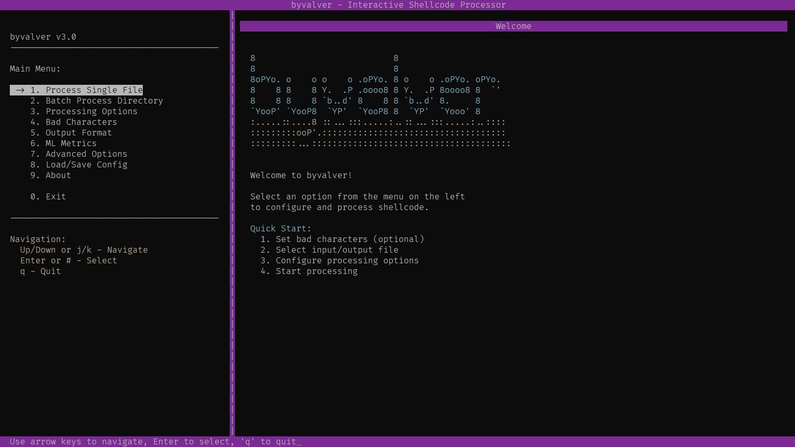
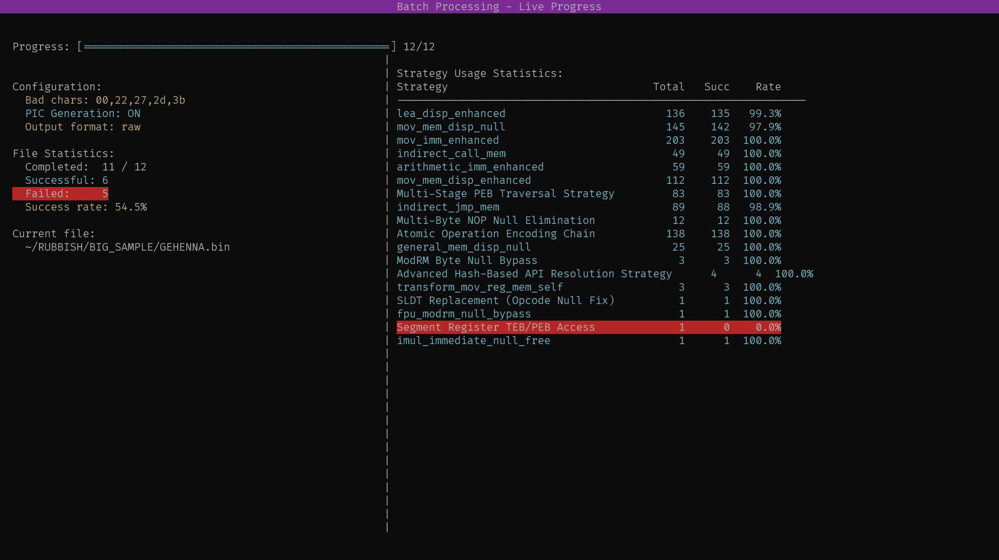
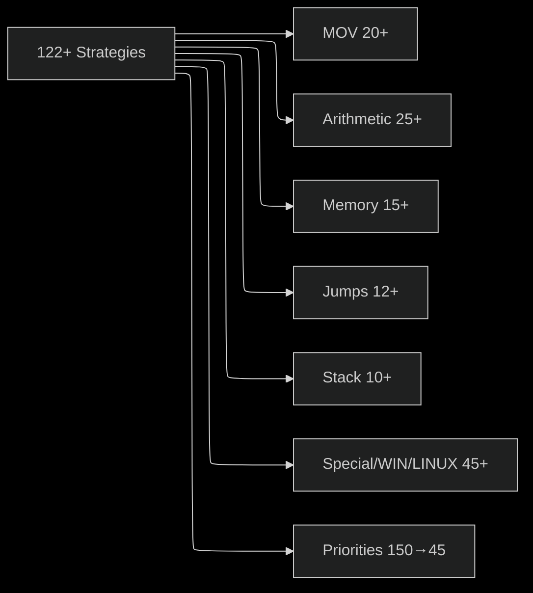

<DOCUMENT filename="README.md">
  
# byvalver (·𐑚𐑲𐑝𐑨𐑤𐑝𐑼)

## THE SHELLCODE BAD-CHARACTER BANISHER

<div align="center">
  
</div>

<div align="center">
  
  
  
  
</div>

<p align="center">
  <a href="#overview">Overview</a> •
  <a href="#bad-character-profiles-v30">Bad-Character Profiles</a> •
  <a href="#generic-bad-character-elimination-v30">Generic Bad-Character Elimination</a> •
  <a href="#features">Features</a> •
  <a href="#architecture">Architecture</a> •
  <a href="#system-requirements">System Requirements</a> •
  <a href="#dependencies">Dependencies</a> •
  <a href="#building">Building</a> •
  <a href="#installation">Installation</a> •
  <a href="#usage">Usage</a> •
  <a href="#obfuscation-strategies">Obfuscation Strategies</a> •
  <a href="#denullification-strategies">Denullification Strategies</a> •
  <a href="#ml-training">ML Training</a> •
  <a href="#development">Development</a> •
  <a href="#troubleshooting">Troubleshooting</a> •
  <a href="#license">License</a>
</p>

<hr>

## Overview

`**byvalver**` is a CLI tool built in `C` for automatically eliminating null-bytes (`\x00`) from x86/x64 shellcode while maintaining complete functional equivalence

The tool uses the `Capstone` disassembly framework to analyze instructions and applies over 153+ ranked transformation strategies to replace null-containing code with equivalent alternatives. It has been extensively tested on null-byte elimination and achieves a high success rate across diverse, real-world shellcode test suites, including complex Windows payloads.

**NEW in v3.0:** Generic bad character elimination framework with two usage modes:

1. **Direct specification**: The `--bad-chars` option allows specification of arbitrary bytes to eliminate (e.g., `--bad-chars "00,0a,0d"` for newline-safe shellcode)
2. **Profile-based**: The `--profile` option uses pre-configured bad-character sets for common exploit scenarios (e.g., `--profile http-newline`, `--profile sql-injection`, `--profile alphanumeric-only`)

**This feature is functional but newly implemented** - the 153+ transformation strategies were originally designed and optimized specifically for null-byte elimination. While they apply to other bad characters, they have not been extensively tested or optimized for non-null byte scenarios.

Supports Windows, Linux, and macOS

**Core Technologies:**
- Pure `C` implementation for efficiency and low-level control
- `Capstone` for precise disassembly
- `NASM` for generating decoder stubs
- Modular strategy pattern for extensible transformations (153+ strategy implementations)
- Neural network integration for intelligent strategy selection
- Biphasic processing: Obfuscation followed by denullification

> [!NOTE]
> **Null-byte elimination** (`--bad-chars "00"` or default): Well-tested with 100% success rate on diverse test corpus
>
> **Generic bad-character elimination** (`--bad-chars "00,0a,0d"` etc.): Newly implemented in v3.0. The framework is functional and strategies apply generically, but effectiveness for non-null characters has not been comprehensively validated. Success rates may vary depending on the specific bad characters and shellcode complexity.

### BAD-BYTE BANISHMENT IN ACTION


## Quick-Start

Get started with `byvalver` in minutes:

### Installation

**Option 1: From GitHub (Recommended)**
```bash
curl -sSL https://raw.githubusercontent.com/umpolungfish/byvalver/main/install.sh | bash
```

**Option 2: Build from Source**
```bash
git clone https://github.com/umpolungfish/byvalver.git
cd byvalver
make
sudo make install
sudo make install-man  # Install man page
```

### Basic Usage

**Eliminate null bytes (default behavior):**
```bash
byvalver input.bin output.bin
```

**Using bad-character profiles (v3.0+):**
```bash
# HTTP contexts (removes null, newline, carriage return)
byvalver --profile http-newline input.bin output.bin

# SQL injection contexts
byvalver --profile sql-injection input.bin output.bin

# Alphanumeric-only shellcode (most restrictive)
byvalver --profile alphanumeric-only input.bin output.bin
```

**Manual bad-character specification:**
```bash
# Eliminate null bytes and newlines
byvalver --bad-chars "00,0a,0d" input.bin output.bin
```

**Advanced features:**
```bash
# Add obfuscation layer before denullification
byvalver --biphasic input.bin output.bin

# Enable ML-powered strategy selection
byvalver --ml input.bin output.bin

# Generate XOR-encoded shellcode with decoder stub
byvalver --xor-encode DEADBEEF input.bin output.bin

# Output in different formats
byvalver --format c input.bin output.c      # C array
byvalver --format python input.bin output.py # Python bytes
byvalver --format hexstring input.bin output.hex # Hex string
```

### Verification

Always verify your transformed shellcode:
```bash
# Check for remaining bad characters
python3 verify_denulled.py --bad-chars "00,0a,0d" output.bin

# Verify functional equivalence
python3 verify_functionality.py input.bin output.bin
```

### Batch Processing

Process entire directories:
```bash
# Process all .bin files recursively
byvalver -r --pattern "*.bin" input_dir/ output_dir/

# Apply HTTP profile to all shellcode in directory
byvalver -r --profile http-newline input_dir/ output_dir/
```

## Interactive TUI

<div align="center">
  
</div>

---

<div align="center">
  
</div>

---

`byvalver` includes an **interactive TUI** (Text User Interface) with **complete CLI feature parity**.  

The TUI provides an intuitive, visual interface for all bad-character elimination operations, including:  

+ batch processing with live statistics
+ ML configuration &
+ comprehensive file browsing

Launch the interactive mode with the `--menu` flag:

```bash
byvalver --menu
```

### Main Features:

The TUI provides 9 main menu options covering all CLI functionality:

1. **Process Single File** - Process individual shellcode files with visual feedback
2. **Batch Process Directory** - Process entire directories with live progress tracking
3. **Configure Processing Options** - Toggle biphasic mode, PIC generation, ML, verbose, dry-run
4. **Set Bad Characters** - Manual entry or select from 13 predefined profiles
5. **Output Format Settings** - Choose from 5 output formats (raw, C, Python, PowerShell, hexstring)
6. **ML Metrics Configuration** - Configure ML strategy selection and metrics tracking
7. **Advanced Options** - XOR encoding, timeouts, limits, validation settings
8. **Load/Save Configuration** - INI-style configuration file management
9. **About byvalver** - Version and help information

### Visual File Browser:

- **Directory navigation** with arrow keys or vi-style j/k keys
- **File/directory distinction** with [FILE] and [DIR] indicators
- **File size display** with human-readable formats (B, KB, MB, GB)
- **Extension filtering** (e.g., *.bin)
- **Intelligent path handling** - Automatically navigates to parent directory if file path is provided
- **Sorted display** - Directories first, then alphabetical
- **Multiple selection modes**:
  - File selection mode: Navigate into directories, select files only
  - Directory selection mode: Select directories for batch processing
  - Both mode: Select either files or directories

### Batch Processing with Live Updates:

The batch processing screen provides **real-time visual feedback**:

- **Progress bar** showing files processed (e.g., `[==============        ] 52/100 files`)
- **Configuration display** showing active settings:
  - Bad characters count and profile used
  - Processing options (Biphasic, PIC, XOR, ML)
  - Output format
- **Live file statistics** with color-coded status:
  - Completed: X / Y (files attempted / total)
  - ✅ Successful (green) - zero bad characters remaining
  - ❌ Failed (red) - errors or remaining bad characters
  - Success rate percentage
- **Current file display** in bold text
- **Next file preview** in yellow/dim text
- **Dynamic strategy statistics table** showing:
  - **All active strategies** (no 10-strategy limit)
  - **Full strategy names** (up to 50 characters, no truncation)
  - Success/failure counts per strategy
  - Success rate percentages
  - Color-coded by performance (green ≥80%, yellow 50-79%, red <50%)
  - Real-time updates every 50ms

### Configuration Management:

Load and save configurations in **INI-style format**:

```ini
[general]
verbose = 0
quiet = 0
show_stats = 1

[processing]
use_biphasic = 0
use_pic_generation = 0
encode_shellcode = 0
xor_key = 0xDEADBEEF

[output]
output_format = raw

[bad_characters]
bad_chars = 00

[ml]
use_ml_strategist = 0
metrics_enabled = 0

[batch]
file_pattern = *.bin
recursive = 0
preserve_structure = 1
```

See `example.conf` for a complete configuration template.

### Bad Character Configuration:

2x input methods available:

1. **Manual Entry** - Comma-separated hex values (e.g., `00,0a,0d`)
2. **Predefined Profiles** - 13 profiles for common scenarios:
   - null-only, http-newline, http-whitespace
   - url-safe, sql-injection, xml-html
   - json-string, format-string, buffer-overflow
   - command-injection, ldap-injection
   - printable-only, alphanumeric-only

### Navigation:

- **Arrow Keys** (↑↓) or **j/k** (vi-style): Navigate between menu options
- **Enter**: Select highlighted option
- **q**: Quit the application or cancel operation
- **0-9**: Quick select menu option by number
- **Space**: Select current directory (in file browser directory mode)

### Requirements:

Interactive mode requires the `ncurses` library to be installed on your system:

```bash
# Ubuntu/Debian
sudo apt install libncurses-dev

# CentOS/RHEL/Fedora
sudo dnf install ncurses-devel

# macOS (with Homebrew)
brew install ncurses
```

The application will automatically detect if ncurses is available and enable TUI support accordingly.

### Build Options:

The TUI support is conditionally compiled based on ncurses availability:

- Default build: `make` - Includes TUI if ncurses is available
- Force TUI build: `make with-tui` - Builds with TUI support (fails if ncurses not available)
- Exclude TUI: `make no-tui` - Builds without TUI support for smaller binary

### Example Workflows:

**Single File Processing:**
1. Launch TUI: `byvalver --menu`
2. Select "1. Process Single File"
3. Browse for input file using visual file browser
4. Browse for output file location
5. Start processing and view results

**Batch Processing:**
1. Launch TUI: `byvalver --menu`
2. Select "2. Batch Process Directory"
3. Browse for input directory containing shellcode files
4. Browse for output directory
5. Configure file pattern (default: <file>.bin) and recursive option
6. Start batch processing and watch live progress with strategy statistics

**Configuration Management:**
1. Configure all options in the TUI (bad chars, output format, ML, etc.)
2. Select "8. Load/Save Configuration"
3. Save current configuration to a file (e.g., `my_config.conf`)
4. Later: Load the configuration file to restore all settings

### Performance Notes:

- **Single file processing**: Instant visual feedback, <1 second for typical shellcode
- **Batch processing**: 50ms delay between files for visual updates
- **Large directories (100+ files)**: Scanning may take 1-2 seconds
- **Strategy initialization**: 2-5 seconds on first run (one-time cost per session)

### Terminal Compatibility:

The TUI has been tested with:
- GNOME Terminal
- Konsole
- xterm
- iTerm2 (macOS)
- Windows Terminal (WSL)
- tmux/screen (works but may have color limitations)

**Minimum recommended terminal size**: 80x24 characters (100x30 or larger recommended for full strategy table during batch processing)

For complete TUI documentation, troubleshooting, and advanced usage, see [TUI_README.md](TUI_README.md).

## Targeted Bad-Character Elimination

### Overview

The `--bad-chars` option allows you to specify any set of bytes to eliminate from your shellcode.

### Implementation Details

`byvalver` operates by:
1. Parsing the comma-separated hex byte list (e.g., `"00,0a,0d"`)
2. Using an O(1) bitmap lookup to identify bad characters in instructions
3. Applying the same 153+ transformation strategies used for null-byte elimination
4. Verifying that the output does not contain the specified bad characters

### Current Status

**Functional:** The framework is fully implemented and operational. All transformation strategies can detect and avoid any specified bad characters.

**Experimental:** The strategies were originally designed, tested, and optimized specifically for null-byte elimination. While they now support generic bad characters at the implementation level, they have not been:
- Extensively tested with non-null bad character sets
- Optimized for specific bad character combinations
- Validated against diverse real-world scenarios with arbitrary bad characters

### Expected Behavior

- **Null bytes only** (`--bad-chars "00"` or default): High success rate (100% on test corpus)
- **Multiple bad characters** (`--bad-chars "00,0a,0d"`): Success rate may vary significantly depending on:
  - Which specific bytes are marked as bad
  - Complexity of the input shellcode
  - Frequency of bad characters in the original shellcode
  - Whether effective alternative encodings exist for the specific bad character set

### Recommendations

1. **For production use:** Stick with default null-byte elimination mode
2. **For experimentation:** Test the `--bad-chars` feature with your specific use case and validate the output
3. **Always verify:** Use `verify_denulled.py --bad-chars "XX,YY"` to confirm all bad characters were eliminated
4. **Expect variability:** Some shellcode may not be fully cleanable with certain bad character sets

### Future Improvements

The generic bad-character feature provides a foundation for:
- Strategy optimization for specific bad character patterns
- Automated discovery of new strategies targeting common bad character combinations
- ML model retraining with diverse bad character training data
- Extended testing and validation

> [!CAUTION]
> Using `--bad-chars` with multiple bad characters significantly increases the complexity of the transformation task. Some shellcode may become impossible to transform if too many bytes are marked as bad, as the tool may run out of alternative encodings. Start with small bad character sets (e.g., `"00,0a"`) and expand gradually while testing the output. Always verify the result with `verify_denulled.py` before deployment.

## Bad-Character Profiles

### Overview

Users can also choose **bad-character profiles** - pre-configured sets of bytes for common exploit scenarios. Instead of manually specifying hex values, use profile names that match your context.

### Available Profiles

| Profile | Difficulty | Bad Chars | Use Case |
|---------|-----------|-----------|----------|
| `null-only` | ░░░░░ Trivial | 1 | Classic buffer overflows (default) |
| `http-newline` | █░░░░ Low | 3 | `HTTP` headers, line-based protocols |
| `http-whitespace` | █░░░░ Low | 5 | `HTTP` parameters, command injection |
| `url-safe` | ███░░ Medium | 23 | `URL` parameters, `GET` requests |
| `sql-injection` | ███░░ Medium | 5 | `SQL` injection contexts |
| `xml-html` | ███░░ Medium | 6 | `XML`/`HTML` injection, `XSS` |
| `json-string` | ███░░ Medium | 34 | `JSON` API injection |
| `format-string` | ███░░ Medium | 3 | Format string vulnerabilities |
| `buffer-overflow` | ███░░ Medium | 5 | Stack/heap overflows with filtering |
| `command-injection` | ███░░ Medium | 20 | Shell command injection |
| `ldap-injection` | ███░░ Medium | 5 | `LDAP` queries |
| `printable-only` | ████░ High | 161 | Text-based protocols (printable ASCII only) |
| `alphanumeric-only` | █████ Extreme | 194 | Alphanumeric-only shellcode (0-9, A-Z, a-z) |

### Usage

```bash
# List all available profiles
byvalver --list-profiles

# Use a specific profile
byvalver --profile http-newline input.bin output.bin

# Combine with other options
byvalver --profile sql-injection --biphasic --format c input.bin output.c
```

### Profile Examples

**HTTP Contexts** (eliminates NULL, LF, CR):
```bash
byvalver --profile http-newline payload.bin http_safe.bin
```

**SQL Injection** (eliminates NULL, quotes, semicolons):
```bash
byvalver --profile sql-injection payload.bin sql_safe.bin
```

**Alphanumeric-Only** (extreme difficulty - only allows 0-9, A-Z, a-z):
```bash
byvalver --profile alphanumeric-only payload.bin alphanum.bin
```

For detailed profile documentation, see [docs/BAD_CHAR_PROFILES.md](docs/BAD_CHAR_PROFILES.md).


## Features

### High Null-Byte Elimination Success Rate
<div align="center">
  <strong>Achieved 100% null-byte elimination on a diverse test corpus representing common and complex null sources.</strong>
</div>

> This success rate applies specifically to null-byte (`\x00`) elimination, which has been extensively tested and optimized.

### Advanced Transformation Engine
153+ strategy implementations covering virtually all common null-byte sources (multiple new strategy families added in v3.0 and v3.6):
- `CALL/POP` and stack-based immediate loading
- `PEB` traversal with hashed API resolution
- Advanced hash-based API resolution with complex algorithms
- Multi-stage `PEB` traversal for multiple DLL loading
- `SALC`, `XCHG`, and flag-based zeroing
- `LEA` for arithmetic substitution
- `Shift` and arithmetic value construction
- Multi-`PUSH` string building
- Stack-based structure construction for Windows structures
- Stack-based string construction with advanced patterns
- `SIB` and displacement rewriting
- Conditional jump displacement handling
- Register remapping and chaining
- Enhanced `SALC`+`REP STOSB` for buffer initialization
- Advanced string operation transformations
- Atomic operation encoding chains
- `FPU` stack-based immediate encoding
- `XLAT` table-based byte translation
- `LAHF`/`SAHF` flag preservation chains
- **NEW in v3.6**: `BCD` arithmetic obfuscation (`AAM`/`AAD`)
- **NEW in v3.6**: `ENTER`/`LEAVE` stack frame alternatives
- **NEW in v3.6**: `POPCNT`/`LZCNT`/`TZCNT` bit counting for constants
- **NEW in v3.6**: `SIMD` `XMM` register immediate loading
- **NEW in v3.6**: `JECXZ`/`JRCXZ` zero-test jump transformations
- Comprehensive support for `MOV`, `ADD/SUB`, `XOR`, `LEA`, `CMP`, `PUSH`, and more

The engine employs multi-pass processing (obfuscation → denulling) with robust fallback mechanisms for edge cases

### Performance Metrics

Real-world performance data from processing 184 diverse shellcode samples:

```
📊 Batch Processing Statistics:

Success Rate:            184/184             █████████████████████████   100.00%
Files Processed:         184                 █████████████████████████   100.00%
Failed:                  0                   ░░░░░░░░░░░░░░░░░░░░░░░░░   00.00%
Skipped:                 0                   ░░░░░░░░░░░░░░░░░░░░░░░░░   00.00%
```

```
🧠 ML Strategy Selection Performance:

Processing Speed:
Instructions/sec:        19.5 inst/sec       ████████████░░░░░░░░░░░░░
Total Instructions:      20,760
Session Duration:        1,067 seconds

Null-Byte Elimination:
Eliminated:              18,636/20,760       ██████████████████████░░░   89.77%
Strategies Applied:      20,129
Success Rate:            92.57%              ███████████████████████░░   92.57%

Learning Progress:
Positive Feedback:       18,636              ███████████████████████░░   92.57%
Negative Feedback:       1,493               █░░░░░░░░░░░░░░░░░░░░░░░░   07.43%
Total Iterations:        40,889
Avg Confidence:          0.0015              ░░░░░░░░░░░░░░░░░░░░░░░░░   00.15%
```

```
🏆 Top Performing Denullification Strategies:

Strategy                                  Attempts    Success%    Confidence
--------                                  --------    --------    ----------
ret_immediate                                  134    █████████████░░░░░░░░░░░░   50.00%
MOVZX/MOVSX Null-Byte Elimination              162    █████████████░░░░░░░░░░░░   50.00%
transform_mov_reg_mem_self                     774    █████████████░░░░░░░░░░░░   50.00%
cmp_mem_reg_null                                96    ████████████░░░░░░░░░░░░░   46.88%
cmp_mem_reg                                    264    ████████████░░░░░░░░░░░░░   46.97%
lea_disp_null                                 3900    ███████████░░░░░░░░░░░░░░   45.38%
transform_add_mem_reg8                        2012    ███████████░░░░░░░░░░░░░░   43.49%
Push Optimized                                4214    ███████░░░░░░░░░░░░░░░░░░   29.31%
ModRM Byte Null Bypass                          82    ██████░░░░░░░░░░░░░░░░░░░   25.61%
conservative_arithmetic                       5172    █████░░░░░░░░░░░░░░░░░░░░   21.37%
arithmetic_addsub_enhanced                    1722    ████░░░░░░░░░░░░░░░░░░░░░   18.12%
PUSH Immediate Null-Byte Elimination          3066    ████░░░░░░░░░░░░░░░░░░░░░   16.54%
SIB Addressing                                9560    ████░░░░░░░░░░░░░░░░░░░░░   16.03%
generic_mem_null_disp_enhanced               22130    ███░░░░░░░░░░░░░░░░░░░░░░   15.52%
SALC-based Zero Comparison                    1654    ███░░░░░░░░░░░░░░░░░░░░░░   12.88%
```

```
⚡ Processing Efficiency:

Learning Rate:           1.97 feedback/instruction
Weight Update Avg:       0.042650
Weight Update Max:       0.100000
Total Weight Updates:    1724.68

Strategy Coverage:
Total Strategies:        153+
Strategies Activated:    117                 ████████████████████████░   95.90%
Zero-Attempt:            5                   █░░░░░░░░░░░░░░░░░░░░░░░░   04.10%
```

### Obfuscation Layer
`--biphasic` mode adds anti-analysis obfuscation prior to denulling:
- Control flow flattening
- Dispatcher patterns
- Register reassignment
- State obfuscation
- Dead code insertion
- NOP sleds
- Instruction substitution
- Equivalent operations
- Stack frame manipulation
- API resolution hiding
- String Encoding
- Constant Encoding
- Anti-debugging
- VM detection techniques

### ML-Powered Strategy Selection (Experimental)
**Architecture v2.0** (December 17, 2025):
- **One-hot instruction encoding** (51 dims) replaces scalar instruction IDs
- **Context window** with sliding buffer of 4 instructions (current + 3 previous)
- **Fixed feature extraction** with stable 84-dimensional layout per instruction
- **Stable strategy registry** ensuring consistent NN output mapping
- **Full backpropagation** through all layers (input→hidden→output)
- **Correct gradient computation** for softmax + cross-entropy loss
- **Output masking** filters invalid strategies before softmax
- **He/Xavier initialization** for proper weight initialization
- 3-layer feedforward neural network (336→512→200)
- Adaptive learning from success/failure feedback
- Tracks predictions, accuracy, and confidence
- Graceful fallback to deterministic ordering

**What Changed in v2.0**:
- Input expanded: 128 → 336 features (4 instructions × 84 features)
- Hidden layer: 256 → 512 neurons (increased for accuracy)
- Parameters: ~84K → ~204K (~2.4× increase)
- Memory: ~660 KB → ~1.66 MB (~2.5× increase)
- Proper categorical encoding (no more false ordinal relationships)
- Sequential pattern learning (context-aware predictions)

> [!NOTE]
> **ML Architecture v2.0**: The ML system has been enhanced with one-hot instruction encoding and context window support, completing all 7 critical issues identified in technical review. Issues 1-5 were fixed in v3.0.1, and issues 6-7 are now fixed in v2.0. See `docs/ML_FIXES_2025.md` for complete details.

> [!WARNING]
> ML mode is experimental and requires further training/validation with the new v2.0 architecture. Use the `--ml` flag to enable (disabled by default). Old v1.0 models are incompatible and must be retrained. Current model requires retraining with diverse datasets.

### Batch Processing
- Recursive directory traversal (`-r`)
- Custom file patterns (`--pattern "*.bin"`)
- Structure preservation or flattening
- Continue-on-error or strict modes
- Compatible with all options (biphasic, PIC, `XOR`, etc.)
- **Enhanced output** (v3.0.2):
  - Per-file size transformations with ratios
  - Detailed bad character identification on failures
  - Success/failure percentages in summary
  - Failed files list (first 10 shown inline)
  - Strict success definition: files with remaining bad characters marked as failed

**Batch Processing Output Example:**
```
===== BATCH PROCESSING SUMMARY =====
Total files:       8
Successfully processed: 1 (12.5%)
Failed:            7 (87.5%)
Skipped:           0

Total input size:  650 bytes
Total output size: 764 bytes
Average size ratio: 1.18x

Bad characters:    5 configured
Configured set:    0x00, 0x09, 0x0a, 0x0d, 0x20

FAILED FILES (7):
  - shellcode1.bin
  - shellcode2.bin
  ...
```

> [!TIP]
> For batch processing large shellcode collections, use `--no-continue-on-error` to identify problematic files early, then process successfully with `--pattern` to exclude failures. The `--verbose` flag helps track progress and identify which strategies work best for your specific shellcode corpus. Files are only counted as successful when they contain **zero remaining bad characters** - partial success is treated as failure.

### Output Options
- Formats: raw binary, `C` array, Python bytes, hex string
- `XOR` encoding with decoder stub (`--xor-encode 0xDEADBEEF`)
- Position-independent code (`--pic`)
- Automatic output directory creation

### Enhanced Statistics (v3.0.2+)
When using `--stats` flag, `byvalver` now provides detailed analytics:

**Strategy Usage Statistics:**
- Shows which transformation strategies were applied
- Success/failure rates for each strategy
- Applications count and average output size per strategy

**File Complexity Analysis:**
- Most complex files (by instruction count)
- Largest/smallest files by input size
- Files with largest expansion ratios
- Bad character elimination statistics per file

**Batch Processing Summary:**
- Success/failure percentages
- Detailed bad character configuration
- Failed files list with options to save full list

**Example Enhanced Output:**
```
===== BATCH PROCESSING SUMMARY =====
Total files:       162
Successfully processed: 131 (80.9%)
Failed:            31 (19.1%)
Skipped:           0

Total input size:  35772920 bytes
Total output size: 81609 bytes
Average size ratio: 0.00x

Bad characters:    3 configured
Configured set:    0x00, 0x0a, 0x0d
====================================

FAILED FILES (31):
  - ./winwin.bin
  - ./stairslide_secure.bin
  ...

📊 DETAILED STATISTICS
=====================
STRATEGY USAGE STATISTICS:
┌─────────────────────────────────────────┬─────────┬─────────┬──────────────┬────────────────┐
│ Strategy Name                           │ Success │ Failure │ Applications │ Avg Output Size│
├─────────────────────────────────────────┼─────────┼─────────┼──────────────┼────────────────┤
│ push_immediate_strategy                 │      45 │       3 │           48 │          12.34 │
│ mov_reg_mem_self                        │      32 │       1 │           33 │           8.21 │
│ ...                                     │     ... │     ... │          ... │           ... │
└─────────────────────────────────────────┴─────────┴─────────┴──────────────┴────────────────┘

FILE COMPLEXITY ANALYSIS:
Most Complex Files (by instruction count):
  - ./complex_payload.bin: 1245 instructions, 4096 -> 5201 bytes (1.27x)

Largest Files (by input size):
  - ./large_payload.bin: 8192 bytes input, 10485 bytes output (1.28x)

Smallest Files (by input size):
  - ./tiny_shellcode.bin: 64 bytes input, 89 bytes output (1.39x)

Largest Expansion (by size ratio):
  - ./expanded.bin: 512 -> 1024 bytes (2.00x expansion)
```

### Verification Suite
Python tools for validation:
- `verify_denulled.py`: Ensures zero bad characters (supports `--bad-chars` for custom verification)
- `verify_functionality.py`: Checks execution patterns
- `verify_semantic.py`: Validates equivalence

> [!IMPORTANT]
> **v3.0.2 Verification:** `byvalver` now performs strict verification during processing. Files with any remaining bad characters are automatically marked as failed and reported with detailed character information

## Architecture

`byvalver` employs a modular strategy-pattern design:
- Pass 1: (Optional) Obfuscation for anti-analysis
- Pass 2: Denullification for null-byte removal
- ML layer for strategy optimization
- Batch system for scalable processing

<div align="center">
  
</div>

## System Requirements

- **OS**: Linux (Ubuntu/Debian/Fedora), macOS (with Homebrew), Windows (via WSL/MSYS2)
- **CPU**: x86/x64 with modern instructions
- **RAM**: 1GB free
- **Disk**: 50MB free
- **Tools**: `C` compiler, Make, Git (recommended)

## Dependencies

- **Core**: GCC/Clang, GNU Make, `Capstone` (v4.0+), `NASM` (v2.13+), xxd
- **Optional**: Clang-Format, Cppcheck, Valgrind
- **ML Training**: Math libraries (included)

### Installation Commands

**Ubuntu/Debian:**
```bash
sudo apt update
sudo apt install build-essential nasm xxd pkg-config libcapstone-dev clang-format cppcheck valgrind
```

**macOS (Homebrew) — macOS Tahoe 26 (and newer):**
```bash
# Core build deps
brew install capstone nasm pkg-config

# xxd is typically already present at /usr/bin/xxd on macOS.
# If it isn't available for some reason, install Vim (xxd is bundled with it):
brew install vim
```

### macOS/Homebrew build fixes (repo changes)
Recent changes were made to improve macOS/Homebrew compatibility (notably on Apple silicon + Homebrew prefix `/opt/homebrew`):
- Updated `Makefile` and `makefile` to **use `CPPFLAGS` during compilation** and **`LDLIBS` during linking**, so `pkg-config`-discovered Capstone flags are honored.
- Normalized the Capstone include path emitted by Homebrew’s `pkg-config` from `.../include/capstone` to `.../include` so the project’s `#include <capstone/capstone.h>` resolves correctly.

Diff summary (high level):
- `$(CC) $(CFLAGS) -c ...` → `$(CC) $(CFLAGS) $(CPPFLAGS) -c ...`
- `$(CC) $(CFLAGS) -o ... $(LDFLAGS)` → `$(CC) $(CFLAGS) $(CPPFLAGS) -o ... $(LDFLAGS) $(LDLIBS)`
- `CAPSTONE_CFLAGS := pkg-config --cflags capstone` → normalized to an include path compatible with `<capstone/capstone.h>`

### Troubleshooting (macOS)
```bash
# Verify xxd is available (macOS usually ships /usr/bin/xxd)
command -v xxd

# Verify Capstone is discoverable via pkg-config
pkg-config --cflags capstone
pkg-config --libs capstone

# Clean rebuild
make clean
make
```

**Windows (WSL):**
Same as Ubuntu/Debian.

## Building

Use the Makefile for builds:

- Default: `make` (optimized executable)
- Debug: `make debug` (symbols, sanitizers)
- Release: `make release` (-O3, native)
- Static: `make static` (self-contained)
- ML Trainer: `make train` (bin/train_model)
- Clean: `make clean` or `make clean-all`

Customization:
```bash
make CC=clang CFLAGS="-O3 -march=native" CPPFLAGS="$(pkg-config --cflags capstone)"
```

View config: `make info`

## Installation

Global install:
```bash
sudo make install
sudo make install-man
```

Uninstall:
```bash
sudo make uninstall
```

From GitHub:
```bash
curl -sSL https://raw.githubusercontent.com/umpolungfish/byvalver/main/install.sh | bash
```

## Usage

```bash
byvalver [OPTIONS] <input> [output]
```

- Input/output can be files or directories (auto-batch)

**Key Options:**
- `-h, --help`: Help
- `-v, --version`: Version
- `-V, --verbose`: Verbose
- `-q, --quiet`: Quiet
- `--bad-chars BYTES`: Comma-separated hex bytes to eliminate (default: "00")
- `--profile NAME`: Use predefined bad-character profile (e.g., http-newline, sql-injection)
- `--list-profiles`: List all available bad-character profiles
- `--biphasic`: Obfuscate + denull
- `--pic`: Position-independent
- `--ml`: ML strategy selection
- `--xor-encode KEY`: `XOR` with stub
- `--format FORMAT`: raw|c|python|hexstring
- `-r, --recursive`: Recursive batch
- `--pattern PATTERN`: File glob
- `--no-preserve-structure`: Flatten output
- `--no-continue-on-error`: Stop on error
- `--menu`: Launch interactive TUI menu

**Examples:**
```bash
# Default: eliminate null bytes only (well-tested, recommended)
byvalver shellcode.bin clean.bin

# v3.0 NEW: List available bad-character profiles
byvalver --list-profiles

# v3.0 NEW: Use predefined profile for HTTP contexts (eliminates 0x00, 0x0A, 0x0D)
byvalver --profile http-newline shellcode.bin clean.bin

# v3.0 NEW: Use profile for SQL injection contexts
byvalver --profile sql-injection shellcode.bin clean.bin

# v3.0 NEW: Use profile for URL-safe shellcode
byvalver --profile url-safe shellcode.bin clean.bin

# v3.0 NEW: Manual bad-char specification (experimental - not extensively tested)
byvalver --bad-chars "00,0a,0d" shellcode.bin clean.bin

# Combined with other features
byvalver --profile http-newline --biphasic --ml input.bin output.bin

# Batch processing with profile
byvalver -r --profile http-whitespace --pattern "*.bin" shellcodes/ output/

# Launch interactive TUI mode
byvalver --menu
```

## Obfuscation Strategies

The obfuscation pass of `byvalver` (enabled via `--biphasic`) applies anti-analysis techniques:

### Core Obfuscation Techniques

- **`MOV Register Exchange`**: `XCHG`/push-pop patterns
- **`MOV Immediate`**: Arithmetic decomposition
- **`Arithmetic Substitution`**: Complex equivalents
- **`Memory Access`**: Indirection and `LEA`
- **`Stack Operations`**: Manual `ESP` handling
- **`Conditional Jumps`**: `SETcc` and moves
- **`Unconditional Jumps`**: Indirect mechanisms
- **`Calls`**: `PUSH` + `JMP`
- **`Control Flow Flattening`**: Dispatcher states
- **`Instruction Substitution`**: Equivalent ops
- **`Dead Code`**: Harmless insertions
- **`Register Reassignment`**: Data flow hiding
- **`Multiplication by One`**: `IMUL` patterns
- **`NOP Sleds`**: Variable padding
- **`Jump Decoys`**: Fake targets
- **`Relative Offsets`**: Calculated jumps
- **`Switch-Based`**: Computed flow
- **`Boolean Expressions`**: De Morgan equivalents
- **`Variable Encoding`**: Reversible transforms
- **`Timing Variations`**: Delays
- **`Register State`**: Complex manipulations
- **`Stack Frames`**: Custom management
- **`API Resolution`**: Complex hashing
- **`String Encoding`**: Runtime decoding
- **`Constants`**: Expression generation
- **`Debugger Detection`**: Obfuscated checks
- **`VM Detection`**: Concealed methods

Priorities favor anti-analysis (high) over simple substitutions (low).

See [OBFUSCATION_STRATS](docs/OBFUSCATION_STRATS.md) for detailed strategy documentation.

## Denullification Strategies

The core denull pass uses over 153 strategies:

### `MOV` Strategies
- Original pass-through
- `NEG`, `NOT`, `XOR`, `Shift`, `ADD/SUB` decompositions

### Arithmetic
- Original, `NEG`, `XOR`, `ADD/SUB`

### Jumps/Control
- `CALL/JMP` indirects
- Generic memory displacement
- Conditional offset elimination

### Advanced
- ModR/M bypass
- Flag-preserving `TEST`
- `SIB` addressing
- `PUSH` optimizations
- Windows-specific: `CALL/POP`, `PEB` hashing, `SALC`, `LEA` arithmetic, `shifts`, stack strings, etc.

### Memory/Displacement
- Displacement null handling
- `LEA` alternatives

Strategies are prioritized and selected via ML or deterministic order  

The modular registry allows easy addition of new strategies to handle emerging shellcode patterns.

See [DENULL_STRATS](docs/DENULL_STRATS.md) for detailed strategy documentation.

## ML Training and Validation

### Comprehensive Fixes (DEC 2025)

The ML system has been completely overhauled to address critical architectural issues:

**What Was Fixed:**
1. ✅ **Feature Vector Stability** - Fixed-layout features (no sliding indices based on operand count)
2. ✅ **Index Consistency** - Stable strategy registry ensuring forward/backward pass alignment
3. ✅ **Full Backpropagation** - Complete gradient updates through all layers
4. ✅ **Correct Gradients** - Fixed softmax + cross-entropy derivative (was using sigmoid derivative)
5. ✅ **Output Masking** - Invalid strategies filtered before softmax to focus gradients

**New Components:**
- `src/ml_strategy_registry.h/c` - Stable bidirectional strategy-to-index mapping
- `docs/ML_FIXES_2025.md` - Complete documentation of all fixes

**Status:** Builds without errors/warnings. Theoretically sound but requires empirical validation.

### Training

Build trainer: `make train`

Run: `./bin/train_model`

- Data: `./shellcodes/`
- Output: `./ml_models/byvalver_ml_model.bin`
- Config: 10k samples, 50 epochs, 20% validation, LR 0.001, batch 32

Model auto-loaded at runtime with path resolution.

### Testing ML Mode

```bash
# Smoke test
./bin/byvalver --ml shellcodes/linux_x86/execve.bin output.bin

# Check registry initialization
./bin/byvalver --ml test.bin output.bin 2>&1 | grep "ML Registry"
# Expected: "ML Registry] Initialized with XXX strategies"

# Batch processing with learning
./bin/byvalver --ml --batch shellcodes/linux_x86/*.bin output/

# View metrics
cat ml_metrics.log
```

**Recommendation:** ML mode needs retraining with diverse bad-character datasets before production use. Currently optimized for null-byte elimination only.

## Development

- Modern `C` with modularity
- Test suite: `python3 test_all_bins.py`
- Code style: Clang-Format
- Analysis: Cppcheck, Valgrind

## Troubleshooting

- Dependencies: Verify `Capstone`/`NASM`/xxd
- Builds: Check PATH_MAX, headers
- ML: Ensure model path
- Nulls: Confirm input format, dependencies

For persistent issues, use verbose mode and check logs  

If bad-char elimination fails on specific shellcode, consider adding targeted strategies to the registry.

## License

byvalver is sicced freely upon the Earth under the [UNLICENSE](./UNLICENSE).

</DOCUMENT>