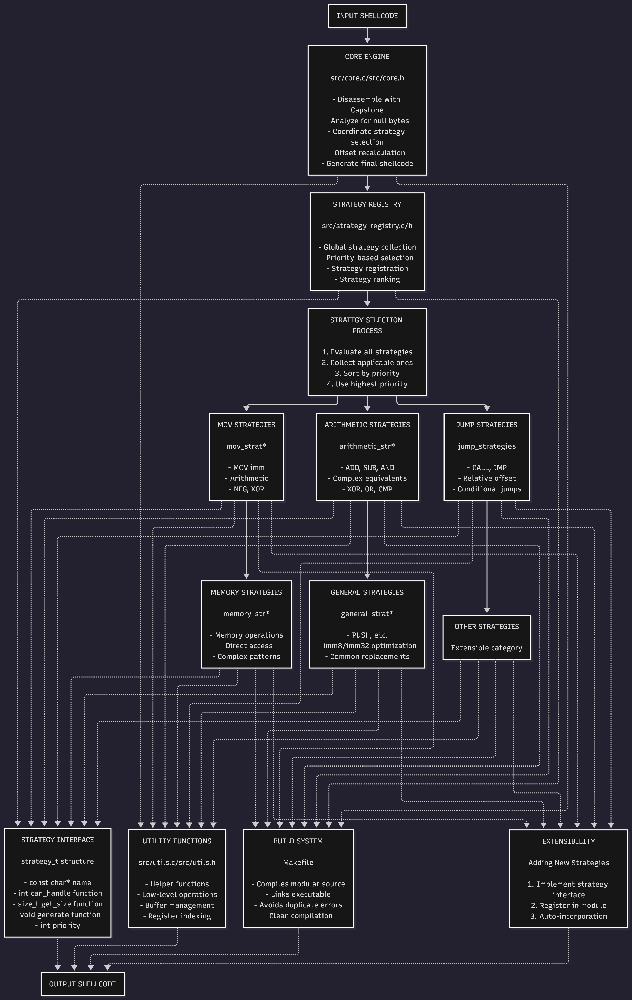
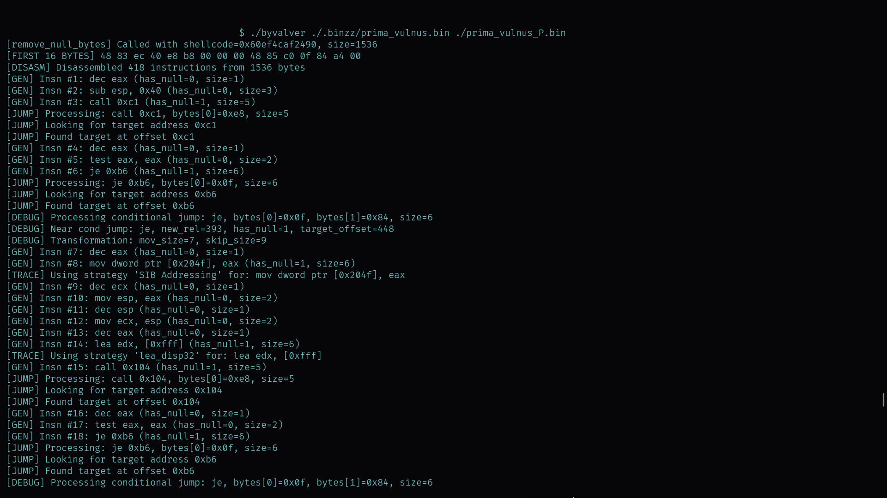
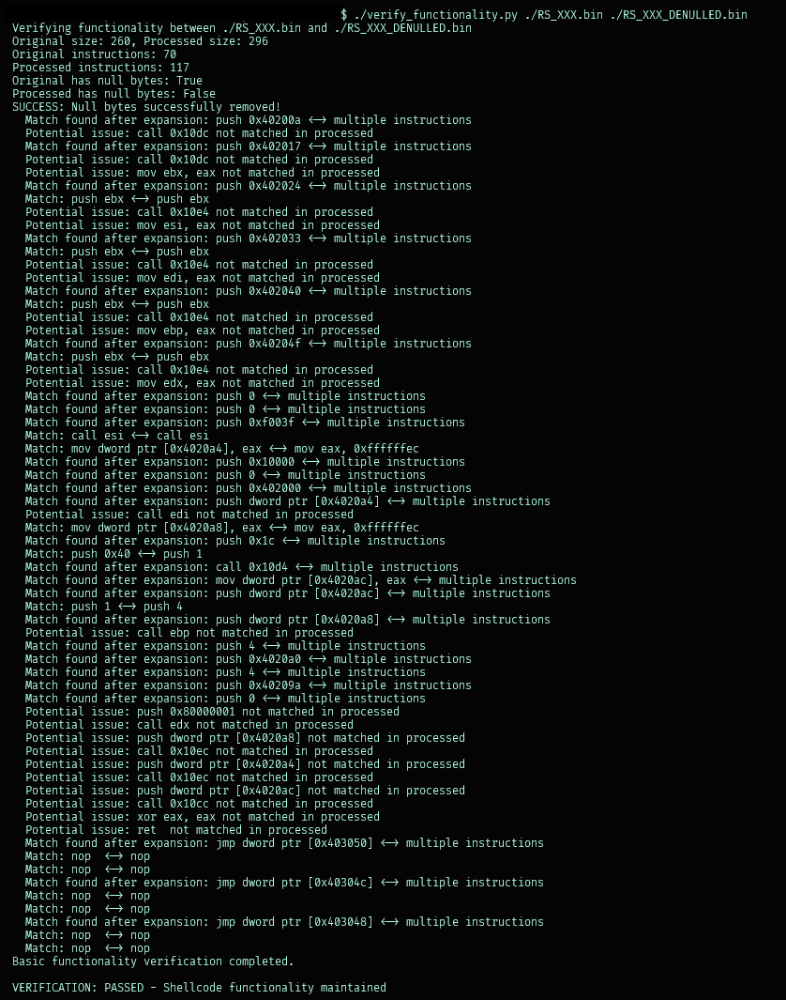

<div align="center">
  <h1>·𐑚𐑲𐑝𐑨𐑤𐑝𐑼 (byvalver)</h1>
  <p><b>THE SHELLCODE NULL-BYTE ELIMINATOR</b></p>
  
  
</div>

<div align="center">
  
  
  &nbsp;
  
  &nbsp;
  
  &nbsp;
  
  
</div>

<p align="center">
  <a href="#overview">Overview</a> •
  <a href="#features">Features</a> •
  <a href="#building-and-usage">Usage</a> •
  <a href="#architecture">Architecture</a> •
  <a href="#strategies">Strategies</a> •
  <a href="#verification">Verification</a> •
  <a href="#contributing">Contributing</a>
</p>

<hr>

<br>

## 🎯 OVERVIEW

**byvalver** is an automated framework designed to algorithmically remove null bytes from shellcode.

`null-bytes` (`\x00`) often act as `string terminators` in many programming languages & environments, causing shellcode containing null-bytes to exit during its own execution.

### 🔄 THE PIPELINE

---

<div align="center">
  
</div>

---

**byvalver**:

1. **TAKES** raw binary shellcode as input
2. **REPLACES** instructions containing null bytes with functionally equivalent, nullbyte-free alternatives
3. **OUTPUTS** clean, nullbyte-free, ready-to-use shellcode

The core of `byvalver` is a powerful disassembly and reconstruction engine built on the [Capstone disassembly framework](http://www.capstone-engine.org/).  

It meticulously analyzes each instruction and applies a growing set of replacement strategies to ensure the final shellcode is both `functional` and `denullified`.

<br>

## 🚀 BUILDING AND USAGE

### PREREQUISITES

- A C compiler (e.g., `gcc`)
- The [Capstone disassembly library](http://www.capstone-engine.org/) installed with development headers
- GNU Binutils (specifically `objcopy`) if you need to process executables like PE or ELF files

### 🔨 BUILDING

To build the project, simply run `make` in the root directory:

```bash
make
```

This will compile the source code and create the `byvalver` executable in the `bin` directory.

### 📝 BASIC USAGE

**1. CREATE A SHELLCODE FILE**

Place your raw binary shellcode into a file (e.g., `shellcode.bin`)

**2. RUN BYVALVER**

```bash
./bin/byvalver shellcode.bin
```

The tool will write the modified, null-free shellcode to `output.bin`

### 🔐 XOR ENCODING FEATURE

`byvalver` includes a powerful XOR encoding feature that allows you to further obfuscate your processed shellcode:

**PROCESS SHELLCODE AND APPLY XOR ENCODING:**

```bash
./bin/byvalver --xor-encode <key> <input_file> [output_file]
```

**PARAMETERS:**
- `<key>` - Required 32-bit hexadecimal key (e.g., `0x12345678`)
- `<input_file>` - Your shellcode file
- `[output_file]` - Optional, defaults to `output.bin`

**EXAMPLE:**

```bash
./bin/byvalver --xor-encode 0x12345678 shellcode.bin encoded_output.bin
```

> **NOTE:** The XOR encoding feature prepends a decoder stub to your processed shellcode. The decoder stub (implemented in `decoder.asm`) uses a JMP-CALL-POP technique to retrieve the XOR key and encoded shellcode length, then decodes the shellcode byte-by-byte before execution. This provides an additional layer of obfuscation on top of null-byte removal.

### 🔧 WORKING WITH EXECUTABLES (PE/ELF Files)

`byvalver` is designed to work with **raw binary shellcode**. For executable formats like PE or ELF, you must first extract the code section.

**EXAMPLE WORKFLOW FOR A PE FILE:**

1. **EXTRACT THE `.text` SECTION:**

```bash
objcopy -O binary --only-section=.text my_app.exe shellcode.bin
```

2. **RUN byvalver:**

```bash
./bin/byvalver shellcode.bin
```

The final, null-free shellcode will be written to `output.bin`

### 👀 INSPECTING THE OUTPUT

The `output.bin` file is a raw binary file. To view its contents in hexadecimal format, use:

```bash
xxd output.bin
# or
hexdump -C output.bin
```

<br>

## ⚡ FEATURES

<table>
<tr>
<td width="50%">

### CORE CAPABILITIES

- ✅ **Automated null-byte removal** from raw shellcode
- 🔍 **Instruction-level analysis** via Capstone disassembly
- 🧠 **Intelligent replacement** using strategy-based approach
- 🔌 **Extensible framework** for new replacement strategies
- 📐 **Relative jump/call patching** maintains control flow integrity
- 💾 **File-based output** for easy integration
- ✓ **Functionality verification** tools included

</td>
<td width="50%">

### UNEXPECTED OPTIMIZATION

When processing even null-free shellcode, byvalver can identify and apply more efficient instruction sequences:

- `51208.asm`: 373 → 360 bytes **(13 bytes smaller)**
- `50722.asm`: 176 → 155 bytes **(21 bytes smaller)**
- `49466.asm`: 84 → 74 bytes **(10 bytes smaller)**
- `36637.c`: 84 → 74 bytes **(10 bytes smaller)**

</td>
</tr>
</table>

<br>

## 🏗️ MODULAR ARCHITECTURE

`byvalver` features a clean, modular architecture seamlessly integrating strategy patterns:

### 📦 CORE COMPONENTS

| Component | File | Purpose |
|-----------|------|---------|
| **Core Engine** | `src/core.c` | Main processing logic using strategy pattern |
| **Utilities** | `src/utils.c` | Helper functions for all strategies |
| **Strategy Registry** | `src/strategy_registry.c` | Manages strategy collection & selection |

### 🎯 STRATEGY MODULES

Specialized modules for different instruction types:

- `src/mov_strategies.c` - MOV instruction replacements
- `src/arithmetic_strategies.c` - Arithmetic operations (ADD, SUB, AND, OR, XOR, CMP)
- `src/memory_strategies.c` - Memory operation replacements
- `src/jump_strategies.c` - Jump and call replacements
- `src/general_strategies.c` - General instructions (PUSH, etc.)
- `src/anti_debug_strategies.c` - Anti-debugging & analysis detection
- `src/shift_strategy.c` - Shift-based immediate value construction
- `src/peb_strategies.c` - PEB traversal strategies
- `src/hash_utils.c` - Hash utilities for API resolution

### 🎨 ARCHITECTURE BENEFITS

<table>
<tr>
<td>🔧 <b>Maintainability</b></td>
<td>Clear separation of concerns</td>
</tr>
<tr>
<td>📈 <b>Extensibility</b></td>
<td>Easy to add new strategies</td>
</tr>
<tr>
<td>✅ <b>Testability</b></td>
<td>Individual module testing</td>
</tr>
<tr>
<td>🚀 <b>Scalability</b></td>
<td>Supports growing strategy count</td>
</tr>
<tr>
<td>🧹 <b>Clean Build</b></td>
<td>All warnings eliminated</td>
</tr>
</table>

<br>

## 🎯 REPLACEMENT STRATEGIES

`byvalver` employs a multi-pass architecture with an extensive set of replacement strategies:

### BASIC INSTRUCTION REPLACEMENTS

<details>
<summary><b>Click to expand basic strategies</b></summary>

| Original | Replacement | Registers |
|----------|-------------|-----------|
| `ADD reg, 1` | `INC reg` | All 32-bit GPRs |
| `SUB reg, 1` | `DEC reg` | All 32-bit GPRs |
| `MOV reg, 0` | `XOR reg, reg` | All 32-bit GPRs |
| `AND reg, 0` | `XOR reg, reg` | All 32-bit GPRs |
| `XOR reg, 0` | `XOR reg, reg` | All 32-bit GPRs |
| `OR reg, 0` | `TEST reg, reg` | All 32-bit GPRs |
| `CMP reg, 0` | `TEST reg, reg` | All 32-bit GPRs |

</details>

### IMMEDIATE VALUE HANDLING

<details>
<summary><b>Click to expand immediate value strategies</b></summary>

- **`MOV reg, imm32`** - Null-free sequence construction
  - Optimized byte-wise construction for EAX
  - Uses PUSH/POP sequence for other registers
  
- **`PUSH imm32`** - Null-free sequence with EAX
  - Automatic selection of `PUSH imm8` when applicable
  
- **`ADD/SUB/AND/OR/XOR/CMP reg, imm32`** - Null-free replacement using temporary register

</details>

### CONTROL FLOW INSTRUCTIONS

<details>
<summary><b>Click to expand control flow strategies</b></summary>

- **`JMP imm32`** - Null-free sequence via register
- **`CALL imm32`** - Null-free sequence via register
- **Relative jumps/calls** - Automatic displacement patching
- **Conditional jumps** - Comprehensive support for all conditional jump types (JE, JNE, JZ, JNZ, JL, JG, JLE, JGE, JB, JAE, etc.)

</details>

### ADVANCED TRANSFORMATION STRATEGIES

<details>
<summary><b>Click to expand advanced strategies</b></summary>

#### 🔄 REGISTER OPTIMIZATION
- **`CDQ`** - Efficient EDX zeroing (1 byte vs 2 bytes for `XOR EDX, EDX`)
- **`MUL`** - Zero both EAX and EDX simultaneously (vs 4 bytes for two XOR operations)

#### ⚡ SHIFT-BASED CONSTRUCTION
- Constructs immediate values using SHL/SHR operations
- Example: `MOV EAX, 0x001FF000` → `MOV EAX, 0x00001FF0; SHL EAX, 12`

#### 📍 POSITION-INDEPENDENT CODe
- **GET PC technique** - CALL/POP method for loading immediate values
- Creates position-independent, null-free code

#### 🔢 ARITHMETIC ENCODING
- **`NEG` operations** - Construct values via negation
  - Example: `MOV EAX, 0x00730071` → `MOV EAX, 0xFF8CFF8F; NEG EAX`
  
- **`NOT` OPERATIONS** - Construct values via bitwise NOT
  - Example: `MOV EAX, 0x11220033` → `MOV EAX, 0xEEDDFFCC; NOT EAX`
  
- **`ADD/SUB` ENCODING** - Multi-step arithmetic construction. The system can now robustly find two null-free values that, when added or subtracted, produce the target immediate.
  - Example: `MOV EAX, 0x00100000` → `MOV EAX, 0x11223344; SUB EAX, 0x11123344`
  
- **`XOR` ENCODING** - XOR-based value construction

#### 🛡️ ANTI-ANALYSIS TECHNIQUES
- **PEB-based debugger checks** - Examines BeingDebugged flag
- **Timing-based detection** - Uses RDTSC for execution delay measurement
- **INT3-based detection** - Identifies debugger presence
- **Alternative PEB traversal** - Multiple methods for kernel32.dll resolution

</details>

<br>

## ✅ VERIFICATION

### VERIFYING DENULLIFICATION

Check that all null bytes have been removed:

```bash
./verify_nulls.py <specific.bin>
```

### VERIFYING FUNCTIONALITY

Confirm that the logical operations are preserved:

```bash
./verify_functionality.py <preprocessed.bin> <processed.bin>
```

### VISUAL OUTPUT

<div align="center">
  
  <p><i>Detecting null bytes in original shellcode</i></p>
  <br>
  
  <p><i>Verifying functionality preservation after transformation</i></p>
</div>

<br>

## 🔬 CORE CONCEPTS

The process of removing null bytes without corrupting shellcode is complex. `byvalver` tackles this with a **multi-pass approach**:

### 1️⃣ DISASSEMBLY PASS
The Capstone engine disassembles the entire shellcode into a linked list of instruction nodes. Each node stores the original instruction details and its offset.

### 2️⃣ SIZING PASS
Each instruction node is analyzed:
- If it contains null bytes, a replacement strategy is chosen and the `new_size` is calculated
- If no null bytes are present, the framework can still apply optimizations and calculate a potentially smaller `new_size`

### 3️⃣ OFFSET CALCULATION PASS
The `new_size` values are used to calculate the `new_offset` for each instruction in the modified shellcode. This is crucial for correctly patching relative jumps and calls.

### 4️⃣ GENERATION AND PATCHING PASS
The tool iterates through instruction nodes:
- Relative `JMP`/`CALL` instructions have their operands patched with newly calculated offsets
- Instructions containing null bytes are replaced with null-free sequences
- Null-free instructions that can be optimized are replaced with more efficient sequences
- Other instructions are preserved as-is

### 5️⃣ OUTPUT
The newly constructed, null-free shellcode is written to file.

<br>

## ⚠️ LIMITATIONS AND FUTURE DEVELOPMENT

`byvalver` is a powerful tool, but still under active development:

### CURRENT LIMITATIONS

- **Efficiency of `generate_mov_eax_imm`** - Could be optimized for multiple non-zero bytes
- **Relative jump/call size changes** - Current implementation assumes size doesn't change (e.g., `EB rel8` → `E9 rel32`)
- **Instruction coverage** - Many x86 instructions and addressing modes remain to be covered
- **8-bit and 16-bit instructions** - Current focus is primarily on 32-bit operations

### FUTURE ROADMAP

- 🔄 Dynamic jump instruction size adjustment
- 📚 Expanded instruction coverage
- 🎯 Enhanced 8-bit and 16-bit register support
- ⚡ Further optimization of immediate value construction
- 🧪 Additional verification and testing tools

<br>

## 🤝 CONTRIBUTING

Contributions are welcome! Feel free to:

- 🐛 Report bugs
- 💡 Suggest new features
- 🔧 Submit pull requests
- 📖 Improve documentation

<br>

## 📄 LICENSE

`byvalver` / `·𐑚𐑲𐑝𐑨𐑤𐑝𐑼` is available in the **public domain**. See [UNLICENSE.md](./UNLICENSE.md) for details.

<br>

<div align="center">
  <hr>
  <p><i>out here creepin' while you're sleepin'!</i></p>
  <p><b>byvalver</b> - get it? cuz like bivalves have shells. and, like bcuz, is of that the thing is, the shellcode.</p>
</div>
