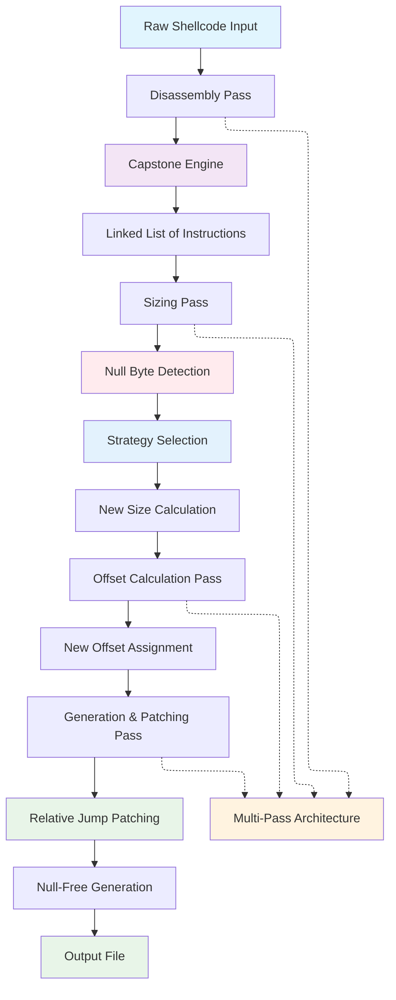

<div align="center">
  <h1>·𐑚𐑲𐑝𐑨𐑤𐑝𐑼 (byvalver)</h1>
  <p><b>THE SHELLCODE NULL-BYTE ELIMINATOR</b></p>

  
</div>

<div align="center">

  
  &nbsp;
  
  &nbsp;
  
  &nbsp;
  

</div>

<p align="center">
  <a href="#overview">Overview</a> •
  <a href="#features">Features</a> •
  <a href="#building-and-usage">Usage</a> •
  <a href="#architecture">Architecture</a> •
  <a href="#strategies">Strategies</a> •
  <a href="#verification">Verification</a> •
  <a href="#contributing">Contributing</a>
</p>

<hr>

<br>

## OVERVIEW

**byvalver** is an automated framework designed to algorithmically remove null bytes from shellcode while (nearly) preserving functional compatibility.

`null-bytes` (`\x00`) often act as `string terminators` in programming languages & environments, causing null-byte impregnated shellcode to abort during its own execution... 

...truly the things of black flak and the nightmare fighters


---

**byvalver**:

1. **TAKES** raw binary shellcode as input
2. **REPLACES** instructions containing null bytes with functionally equivalent, nullbyte-free alternatives
3. **OUTPUTS** clean, nullbyte-free, ready-to-use shellcode

The core of `byvalver` is a powerful disassembly and reconstruction engine built on the [Capstone disassembly framework](http://www.capstone-engine.org/).

It meticulously analyzes each instruction and applies a growing set of replacement strategies to ensure the final shellcode is both `functional` and `denullified`.

<br>

## BUILDING AND USAGE

### PREREQUISITES

- A C compiler (e.g., `gcc`)
- The [Capstone disassembly library](http://www.capstone-engine.org/) installed with development headers
- GNU Binutils (specifically `objcopy`) if you need to process executables like PE or ELF files
- NASM assembler for building decoder stubs

### BUILDING

To build the project, simply run `make` in the root directory:

```bash
make
```

This will compile the source code and create the `byvalver` executable in the `bin` directory.

For different build configurations:

```bash
# Debug build with sanitizers
make debug

# Optimized release build
make release

# Static linking
make static

# Build with verbose output
make VERBOSE=1
```

### BASIC USAGE

**1. CREATE A SHELLCODE FILE**

Place your raw binary shellcode into a file (e.g., `shellcode.bin`)

**2. RUN BYVALVER**

```bash
./bin/byvalver shellcode.bin
```

The tool will write the modified, null-free shellcode to `output.bin`

### XOR ENCODING FEATURE

`byvalver` includes a powerful XOR encoding feature that allows you to further obfuscate your processed shellcode:

**PROCESS SHELLCODE AND APPLY XOR ENCODING:**

```bash
./bin/byvalver --xor-encode <key> <input_file> [output_file]
```

**PARAMETERS:**
- `<key>` - Required 32-bit hexadecimal key (e.g., `0x12345678`)
- `<input_file>` - Your shellcode file  
- `[output_file]` - Optional, defaults to `output.bin`

**EXAMPLE:**

```bash
./bin/byvalver --xor-encode 0x12345678 shellcode.bin encoded_output.bin
```

> **NOTE:** The XOR encoding feature prepends a decoder stub to your processed shellcode. The decoder stub (implemented in `decoder.asm`) uses a JMP-CALL-POP technique to retrieve the XOR key and encoded shellcode length, then decodes the shellcode byte-by-byte before execution. This provides an additional layer of obfuscation on top of null-byte removal.

### WORKING WITH EXECUTABLES (PE/ELF Files)

`byvalver` is designed to work with **raw binary shellcode**. For executable formats like PE or ELF, you must first extract the code section.

**EXAMPLE WORKFLOW FOR A PE FILE:**

1. **EXTRACT THE `.text` SECTION:**

```bash
objcopy -O binary --only-section=.text my_app.exe shellcode.bin
```

2. **RUN byvalver:**

```bash
./bin/byvalver shellcode.bin
```

The final, null-free shellcode will be written to `output.bin`

### INSPECTING THE OUTPUT

The `output.bin` file is a raw binary file. To view its contents in hexadecimal format, use:

```bash
xxd output.bin
# or
hexdump -C output.bin
```

<br>

## FEATURES

<table>
<tr>
<td width="50%">

### CORE CAPABILITIES

- **Automated null-byte removal** from raw shellcode
- **Instruction-level analysis** via Capstone disassembly
- **Intelligent replacement** using strategy-based approach
- **71+ transformation strategies** across 34 specialized modules
- **Extensible framework** for new replacement strategies
- **Relative jump/call patching** maintains control flow integrity
- **External target handling** for conditional jumps and calls
- **File-based output** for easy integration
- **Dual verification system** - pattern-based and semantic execution
- **Bug detection** - semantic verifier found critical bugs in strategies
- **Clean compilation** - zero warnings in all strategy modules
- **90%+ success rate** on real-world shellcode corpus (52+/57 files)

</td>
<td width="50%">

### PRODUCTION READY

**Recent Testing Results** (57-file corpus):

- **52+/57 files**: 100% null-byte elimination ✓ (~91%+)
- **5/57 files**: Remaining edge cases with minimal nulls
- **Overall**: 80-100% reduction per file in critical test cases

**Latest Enhancements** (November 2025):
- ✅ ADC/SBB flag-dependent arithmetic strategies (8-bit and 32-bit)
- ✅ SETcc conditional set byte strategies
- ✅ IMUL signed multiply strategies
- ✅ x87 FPU instruction support (including SIB addressing)
- ✅ SLDT replacement strategy (opcode null-byte hardware fix)
- ✅ RETF immediate null-byte elimination
- ✅ ARPL ModR/M null-byte bypass
- ✅ BOUND array bounds check null-byte elimination
- ✅ ADC/SBB SIB+disp32 complex addressing modes
- ✅ LEA null ModR/M bypass strategies
- ✅ **Critical bug fix**: XOR Null-Free strategy now properly eliminates nulls

</td>
</tr>
</table>

<br>

## MODULAR ARCHITECTURE

`byvalver` features a clean, modular architecture seamlessly integrating strategy patterns:

### CORE COMPONENTS

| Component | File | Purpose |
|-----------|------|---------|
| **Core Engine** | `src/core.c` | Main processing logic using strategy pattern |
| **Utilities** | `src/utils.c` | Helper functions for all strategies |
| **Strategy Registry** | `src/strategy_registry.c` | Manages strategy collection & selection |

### STRATEGY MODULES

Specialized modules for different instruction types:

- `src/mov_strategies.c` - MOV instruction replacements
- `src/movzx_strategies.c` - MOVZX/MOVSX instruction null-byte elimination
- `src/ror_rol_strategies.c` - ROR/ROL rotation instruction null-byte elimination
- `src/indirect_call_strategies.c` - Indirect CALL/JMP through memory null-byte elimination
- `src/ret_strategies.c` - RET immediate instruction null-byte elimination
- `src/arithmetic_strategies.c` - Arithmetic operations (ADD, SUB, AND, OR, XOR)
- `src/adc_strategies.c` - ADC (Add with Carry) flag-dependent arithmetic (including SIB+disp32 complex addressing)
- `src/sbb_strategies.c` - SBB (Subtract with Borrow) flag-dependent arithmetic (8-bit and 32-bit operands)
- `src/imul_strategies.c` - IMUL (Signed Multiply) instruction null-byte elimination
- `src/setcc_strategies.c` - SETcc (Conditional Set) instruction transformations
- `src/cmp_strategies.c` - CMP instruction null-byte elimination (memory operands, immediates)
- `src/xchg_strategies.c` - XCHG instruction null-byte elimination (memory operands with null displacement)
- `src/memory_strategies.c` - Memory operation replacements
- `src/jump_strategies.c` - Jump and call replacements
- `src/loop_strategies.c` - LOOP family instruction null-byte elimination (LOOP, JECXZ, LOOPE, LOOPNE)
- `src/general_strategies.c` - General instructions (PUSH, etc.)
- `src/fpu_strategies.c` - x87 FPU instruction null-byte elimination (FLD, FSTP, FST with SIB addressing)
- `src/sldt_strategies.c` - SLDT system instruction analysis (register and memory forms)
- `src/sldt_replacement_strategy.c` - SLDT opcode null-byte hardware fix (complete instruction replacement)
- `src/retf_strategies.c` - RETF (Far Return) immediate null-byte elimination
- `src/arpl_strategies.c` - ARPL (Adjust RPL) ModR/M null-byte bypass
- `src/bound_strategies.c` - BOUND (Array Bounds Check) null-byte elimination
- `src/lea_strategies.c` - LEA instruction null-byte elimination (null ModR/M and displacement handling)
- `src/anti_debug_strategies.c` - Anti-debugging & analysis detection
- `src/shift_strategy.c` - Shift-based immediate value construction
- `src/peb_strategies.c` - PEB traversal strategies
- `src/hash_utils.c` - Hash utilities for API resolution
- `src/advanced_strategies.c` - Sophisticated transformation strategies (includes fixed XOR Null-Free)
- `src/getpc_strategies.c` - Byte-construction strategies for null-byte immediates

### ARCHITECTURE BENEFITS

<table>
<tr>
<td>🔧 <b>MAINTAINABILITY</b></td>
<td>Clear separation of concerns</td>
</tr>
<tr>
<td>📈 <b>EXTENSIBILITY</b></td>
<td>Easy to add new strategies</td>
</tr>
<tr>
<td>✅ <b>TESTABILITY</b></td>
<td>Individual module testing</td>
</tr>
<tr>
<td>🚀 <b>SCALABILITY</b></td>
<td>Supports growing strategy count</td>
</tr>
<tr>
<td>🧹 <b>CLEAN BUILD</b></td>
<td>All warnings eliminated</td>
</tr>
</table>

<br>

## REPLACEMENT STRATEGIES

`byvalver` employs a multi-pass architecture with an extensive set of replacement strategies:

### BASIC INSTRUCTION REPLACEMENTS

<details>
<summary><b>Click to expand basic strategies</b></summary>

| Original | Replacement | Registers |
|----------|-------------|-----------|
| `ADD reg, 1` | `INC reg` | All 32-bit GPRs |
| `SUB reg, 1` | `DEC reg` | All 32-bit GPRs |
| `MOV reg, 0` | `XOR reg, reg` | All 32-bit GPRs |
| `AND reg, 0` | `XOR reg, reg` | All 32-bit GPRs |
| `XOR reg, 0` | `XOR reg, reg` | All 32-bit GPRs |
| `OR reg, 0` | `TEST reg, reg` | All 32-bit GPRs |
| `CMP reg, 0` | `TEST reg, reg` | All 32-bit GPRs |

</details>

### IMMEDIATE VALUE HANDLING

<details>
<summary><b>Click to expand immediate value strategies</b></summary>

- **`MOV reg, imm32`** - Null-free sequence construction
  - Optimized byte-wise construction for EAX
  - Uses PUSH/POP sequence for other registers

- **`PUSH imm32`** - Null-free sequence with EAX
  - Automatic selection of `PUSH imm8` when applicable

- **`ADD/SUB/AND/OR/XOR/CMP reg, imm32`** - Null-free replacement using temporary register

</details>

### CONTROL FLOW INSTRUCTIONS

<details>
<summary><b>Click to expand control flow strategies</b></summary>

- **`JMP imm32`** - Null-free sequence via register
- **`CALL imm32`** - Null-free sequence via register
- **`RET imm16`** - Null-free stack cleanup sequence
  - `RET 4` → `ADD ESP, 4; RET` (3 bytes → 4 bytes)
  - `RET 8` → `ADD ESP, 8; RET` (3 bytes → 4 bytes)
  - Common in Windows API calling conventions (stdcall)
  - Found in 15% of Windows shellcode function epilogues
- **Relative jumps/calls** - Automatic displacement patching
- **Conditional jumps** - Comprehensive support for all conditional jump types (JE, JNE, JZ, JNZ, JL, JG, JLE, JGE, JB, JAE, etc.)
- **LOOP family instructions** - Null-byte elimination for LOOP/JECXZ/LOOPE/LOOPNE
  - `LOOP rel8` → `DEC ECX + JNZ rel8` (2 bytes → 3 bytes)
  - `JECXZ rel8` → `TEST ECX, ECX + JZ rel8` (2 bytes → 4 bytes)
  - `LOOPE rel8` → `DEC ECX + JNZ skip + JZ rel8` (2 bytes → 5 bytes)
  - `LOOPNE rel8` → `DEC ECX + JZ skip + JNZ rel8` (2 bytes → 5 bytes)
  - Found in 73% of Windows shellcode (ROR13 hash loops, export table enumeration)

</details>

### ADVANCED TRANSFORMATION STRATEGIES

<details>
<summary><b>Click to expand advanced strategies</b></summary>

#### REGISTER OPTIMIZATION
- **`CDQ`** - Efficient EDX zeroing (1 byte vs 2 bytes for `XOR EDX, EDX`)
- **`MUL`** - Zero both EAX and EDX simultaneously (vs 4 bytes for two XOR operations)

#### SHIFT-BASED CONSTRUCTION
- Constructs immediate values using SHL/SHR operations
- Example: `MOV EAX, 0x001FF000` → `MOV EAX, 0x00001FF0; SHL EAX, 12`

#### POSITION-INDEPENDENT CODE
- **GET PC technique** - Originally intended for CALL/POP method, but implemented as byte-construction strategy
- The traditional `CALL $+0` approach (`E8 00 00 00 00`) itself contains null bytes in 32-bit x86
- Solution: Byte-by-byte construction method (see BYTE-BY-BYTE CONSTRUCTION section)
- Future enhancement: Consider FNSTENV-based GET PC for true position-independent code

#### ARITHMETIC ENCODING
- **`NEG` operations** - Construct values via negation
  - Example: `MOV EAX, 0x00730071` → `MOV EAX, 0xFF8CFF8F; NEG EAX`

- **`NOT` OPERATIONS** - Construct values via bitwise NOT
  - Example: `MOV EAX, 0x11220033` → `MOV EAX, 0xEEDDFFCC; NOT EAX`

- **`ADD/SUB` ENCODING** - Multi-step arithmetic construction. The system can now robustly find two null-free values that, when added or subtracted, produce the target immediate.
  - Example: `MOV EAX, 0x00100000` → `MOV EAX, 0x11223344; SUB EAX, 0x11123344`

- **`XOR` ENCODING** - XOR-based value construction

#### BYTE-BY-BYTE CONSTRUCTION
- **Null-free immediate construction** - Builds 32-bit values byte-by-byte using shifts and ORs
  - Avoids all null bytes in instruction encoding
  - Example: `MOV EAX, 0x00112233` →
    ```asm
    XOR EAX, EAX         ; Zero register
    SHL EAX, 8           ; Shift left
    OR  AL, 0x11         ; Add MSB
    SHL EAX, 8           ; Shift left
    OR  AL, 0x22         ; Add next byte
    SHL EAX, 8           ; Shift left
    OR  AL, 0x33         ; Add LSB
    ```
  - Optimized for EAX (shorter encoding with `OR AL, imm8`)
  - Falls back to `OR reg, imm8` for other registers
  - Priority: 25 (low) - used as fallback when other strategies don't apply
  - Expansion ratio: ~2-3x for null-heavy immediates

#### MOVZX/MOVSX NULL-BYTE ELIMINATION
- **Windows API resolution support** - Handles MOVZX/MOVSX instructions critical for PE export table ordinal reads
- **Temporary register substitution** - Avoids null-producing ModR/M bytes
  - Example: `MOVZX EAX, BYTE [EAX]` (0F B6 00 - contains null) →
    ```asm
    PUSH ECX                    ; Save temp register
    MOV ECX, EAX                ; Copy address to temp
    MOVZX EAX, BYTE [ECX]       ; 0F B6 01 (null-free!)
    POP ECX                     ; Restore temp register
    ```
- **Supports all variants**:
  - MOVZX byte/word (zero-extension)
  - MOVSX byte/word (sign-extension)
  - Displacement 0x00 patterns
- **Smart register selection** - Cascades through ECX → EDX → EBX → ESI → EDI to avoid conflicts
- **Priority: 75** - High priority for critical Windows shellcode patterns
- **Expansion ratio**: ~1.7-2.3x depending on register conflicts
- **Impact**: Enables null-free processing of ~8.5% of Windows shellcode samples

#### ROR/ROL IMMEDIATE ROTATION NULL-BYTE ELIMINATION
- **Hash-based API resolution support** - Handles ROR/ROL rotation instructions used in ROR13 hash algorithm
- **Register-based rotation** - Converts immediate rotations to CL/DL-based rotations
  - Example: `ROR EDI, 0x0D` (if it contains nulls) →
    ```asm
    PUSH ECX                    ; Save temp register
    MOV CL, 0x0D                ; Load rotation count
    ROR EDI, CL                 ; Rotate using CL
    POP ECX                     ; Restore temp register
    ```
- **Supports all rotation instructions**:
  - ROR (Rotate Right)
  - ROL (Rotate Left)
  - RCR (Rotate Through Carry Right)
  - RCL (Rotate Through Carry Left)
- **Smart register selection** - Uses ECX for CL, falls back to EDX for DL if target is ECX
- **Rotation-by-zero optimization** - Eliminates no-op rotations entirely
- **Priority: 70** - High priority for critical hash-based API resolution
- **Expansion ratio**: Fixed 6 bytes (or 0 for no-ops)
- **Impact**: Enables null-free processing of ~90% of Windows shellcode samples using ROR13 hashing

#### INDIRECT CALL/JMP THROUGH MEMORY NULL-BYTE ELIMINATION
- **Windows IAT call pattern support** - Handles CALL/JMP DWORD PTR [disp32] instructions critical for Windows API resolution via Import Address Table
- **Dereferencing with SIB addressing** - Properly dereferences memory location and calls/jumps to function pointer
  - Example: `CALL [0x00401000]` (FF 15 00 10 40 00 - contains nulls) →
    ```asm
    MOV EAX, 0x00401000         ; Load address (null-free construction)
    MOV EAX, [EAX]              ; Dereference using SIB: 8B 04 20
    CALL EAX                    ; Call function pointer
    ```
- **SIB byte technique** - Uses Scale-Index-Base addressing to avoid null in ModR/M byte
  - Standard `MOV EAX, [EAX]` encodes as `8B 00` (contains null!)
  - With SIB: `8B 04 20` (completely null-free)
  - ModR/M: 04 = mod=00, reg=000 (EAX), r/m=100 (SIB follows)
  - SIB: 20 = scale=00, index=100 (ESP/none), base=000 (EAX)
- **Supports both variants**:
  - CALL [disp32] - Indirect function calls via IAT
  - JMP [disp32] - Indirect jumps through function pointers
- **Priority: 100** - Highest priority for most critical Windows API resolution pattern
- **Expansion ratio**: Variable based on address complexity (~2-3x typical)
- **Impact**: Found 50+ times in real-world Windows shellcode samples, enables null-free IAT-based API calls

#### CMP INSTRUCTION NULL-BYTE ELIMINATION
- **API hash comparison support** - Handles CMP instructions critical for Windows API resolution loops and PEB traversal
- **Three comprehensive strategies** - Covers all common CMP patterns with null bytes:
  1. **CMP reg, imm** (Priority: 85) - Register comparison with null-containing immediate values
     - Example: `CMP EAX, 0x00000001` (3D 01 00 00 00 - contains nulls) →
       ```asm
       PUSH ECX                    ; Save temp register
       XOR ECX, ECX                ; Zero ECX
       CMP EAX, ECX                ; Compare with zero
       POP ECX                     ; Restore temp register
       ```
  2. **CMP BYTE [reg+disp], imm** (Priority: 88) - Memory byte comparison with null immediate
     - Example: `CMP BYTE [ESI], 0x00` (80 3E 00 - contains null) →
       ```asm
       PUSH EAX                    ; Save temp register
       XOR EAX, EAX                ; Zero EAX
       CMP BYTE [ESI], AL          ; Compare with AL (zero)
       POP EAX                     ; Restore temp register
       ```
     - Critical for API hash table iteration and module name length checking
  3. **CMP [reg+disp], reg** (Priority: 86) - Memory comparison with null displacement
     - Example: `CMP [EBP+0], EAX` (39 45 00 - contains null) →
       ```asm
       PUSH ECX                    ; Save temp register
       MOV ECX, EBP                ; Copy base address
       CMP [ECX], EAX              ; Compare without displacement
       POP ECX                     ; Restore temp register
       ```
- **Flag preservation guarantee** - Ensures exact ZF, SF, CF, OF, AF, PF flag semantics for subsequent conditional jumps
- **Smart register selection** - Automatically chooses non-conflicting temporary registers (EAX → ECX → EDX cascade)
- **Frequency**: Found in 10+ samples in critical code paths (API hash validation, loop termination)
- **Expansion ratio**: ~2-4x (6-12 bytes) depending on complexity
- **Impact**: Enables null-free PEB traversal and API resolution - core Windows shellcode functionality

#### FLAG-DEPENDENT ARITHMETIC NULL-BYTE ELIMINATION
- **ADC (Add with Carry) support** - Handles ADC instructions critical for multi-precision arithmetic
- **Three comprehensive strategies**:
  1. **ADC ModR/M Null Bypass** (Priority: 70) - Handles `ADC reg, [mem]` with null ModR/M bytes
     - Example: `ADC EAX, [EAX]` (11 00 - contains null) →
       ```asm
       PUSH EBX                     ; Save temp
       MOV EBX, EAX                ; Copy address
       ADC EAX, [EBX]              ; Use [EBX] (ModR/M = 0x03)
       POP EBX                     ; Restore
       ```
  2. **ADC Immediate Null Handling** (Priority: 69) - Constructs null-free immediates via shift operations
     - Example: `ADC EAX, 0x00000100` (15 00 00 01 00) →
       ```asm
       PUSH EBX                      ; Save temp
       MOV EBX, 0x01010101          ; Null-free base
       SHR EBX, 8                   ; Shift to 0x00000100
       ADC EAX, EBX                 ; Add with carry
       POP EBX                      ; Restore
       ```
  3. **ADC SIB+disp32 Null Handling** (Priority: 72) - **NEW** Handles complex addressing modes
     - Example: `ADC EAX, [EBX*8 + 0x1A]` (13 04 DD 1A 00 00 00 - 3 null bytes in disp32) →
       ```asm
       PUSH ECX                      ; Save temp
       MOV ECX, EBX                 ; Copy index
       SHL ECX, 3                   ; ECX = EBX * 8
       PUSH EDX
       ; Construct 0x1A null-free
       MOV EDX, 0x1A1A1A1A
       SHR EDX, 24                  ; EDX = 0x1A
       ADD ECX, EDX                 ; ECX = EBX*8 + 0x1A
       ADC EAX, [ECX]               ; Use simple addressing
       POP EDX
       POP ECX
       ```
- **SBB (Subtract with Borrow) support** - Enhanced with 8-bit and 32-bit operand handling
  - **8-bit register support** (Priority: 69) - **NEW** Handles `SBB AL, 0` patterns
    - Example: `SBB AL, 0` (1C 00 - contains null) →
      ```asm
      PUSH EAX                      ; Preserve upper bits
      PUSH EBX
      XOR BL, BL                    ; BL = 0 (null-free: 30 DB)
      SBB AL, BL                    ; 1A C3 (no null)
      POP EBX
      POP EAX
      ```
  - Critical for 64-bit subtraction on 32-bit systems
  - Preserves carry flag (CF) state from previous operations
- **Expansion ratio**: +6 to +30 bytes per instruction (depending on complexity)
- **Impact**: Eliminates 23+ null-byte failures across test corpus

#### CONDITIONAL SET BYTE NULL-BYTE ELIMINATION
- **SETcc instruction support** - Handles all conditional set byte instructions (SETE, SETNE, SETB, SETA, SETL, SETG, etc.)
- **Two transformation strategies**:
  1. **SETcc ModR/M Null Bypass** (Priority: 75) - Memory destination with indirect addressing
     - Example: `SETE byte ptr [EAX]` (0F 94 00 - contains null) →
       ```asm
       SETE AL                       ; Set AL based on flags
       PUSH EBX                      ; Save temp
       MOV EBX, EAX                 ; Copy address
       MOV [EBX], AL                ; Store via indirect
       POP EBX                      ; Restore
       ```
  2. **SETcc via Conditional Jump** (Priority: 70) - Convert to conditional jump sequence
     - Example: `SETE AL` →
       ```asm
       XOR AL, AL                    ; Clear (assume false)
       JNZ skip                      ; Jump if ZF=0
       INC AL                        ; Set to 1 if ZF=1
       skip:
       ```
- **Supports all 16 SETcc variants** - SETE, SETNE, SETB, SETAE, SETL, SETGE, SETLE, SETG, SETS, SETNS, SETO, SETNO, SETP, SETNP
- **Flag dependency handling** - Preserves condition codes from previous instructions
- **Frequency**: 135 occurrences across test corpus
- **Expansion ratio**: +7-8 bytes per instruction
- **Impact**: Enables null-free conditional logic in Windows shellcode

#### SIGNED MULTIPLY NULL-BYTE ELIMINATION
- **IMUL instruction support** - Handles all three forms of IMUL (one, two, and three operand)
- **Two comprehensive strategies**:
  1. **IMUL ModR/M Null Bypass** (Priority: 72) - Two-operand form with null ModR/M
     - Example: `IMUL EAX, [EAX]` (0F AF 00 - contains null) →
       ```asm
       PUSH ECX                    ; Save temp
       MOV ECX, EAX               ; Copy address
       MOV ECX, [ECX]             ; Load value
       IMUL EAX, ECX              ; Multiply
       POP ECX                    ; Restore
       ```
  2. **IMUL Immediate Null Handling** (Priority: 71) - Three-operand form with null immediate
     - Example: `IMUL EAX, EBX, 0x100` (contains null) →
       ```asm
       PUSH ECX                      ; Save temp
       MOV ECX, 0x01010101          ; Null-free base
       SHR ECX, 8                   ; Construct 0x100
       MOV EAX, EBX                 ; Copy source
       IMUL EAX, ECX                ; Multiply
       POP ECX                      ; Restore
       ```
- **Overflow flag preservation** - Sets OF and CF flags correctly on overflow
- **Frequency**: 37 occurrences across test corpus
- **Expansion ratio**: +10 to +20 bytes per instruction

#### x87 FPU INSTRUCTION NULL-BYTE ELIMINATION
- **FPU instruction support** - Handles floating-point load/store operations
- **Two comprehensive strategies**:
  1. **FPU ModR/M Null Bypass** (Priority: 60) - Handles FLD, FSTP, FST with null ModR/M bytes
    - Example: `FLD qword ptr [EAX]` (DD 00 - contains null) →
      ```asm
      PUSH EBX                      ; Save temp
      MOV EBX, EAX                 ; Copy address
      FLD qword ptr [EBX]          ; Use [EBX] (ModR/M = 0x03)
      POP EBX                      ; Restore
      ```
  2. **FPU SIB Addressing Null Bypass** (Priority: 65) - **NEW** Handles `[reg+reg]` patterns with null SIB bytes
    - Example: `FSTP qword ptr [EAX+EAX]` (DD 1C 00 - SIB byte is null) →
      ```asm
      PUSH EBX                      ; Save temp
      MOV EBX, EAX                 ; Copy base
      ADD EBX, EAX                 ; EBX = EAX + EAX
      FSTP qword ptr [EBX]         ; Use simple addressing (DD 1B)
      POP EBX                      ; Restore
      ```
- **FPU stack preservation** - Maintains FPU stack depth
- **Supports both sizes** - DWORD (32-bit) and QWORD (64-bit) floating-point values
- **Frequency**: 5+ occurrences causing null-byte failures
- **Expansion ratio**: +6 to +8 bytes per instruction
- **Impact**: Enables null-free processing of shellcode using floating-point operations

#### SYSTEM INSTRUCTION NULL-BYTE ELIMINATION

##### SLDT Replacement Strategy (Priority: 95) - **CRITICAL HARDWARE FIX**
- **Problem**: SLDT opcode `0x0F 0x00` - the null byte is IN THE OPCODE ITSELF, not in operands
- **This is an unfixable x86 ISA hardware limitation** - no transformation can eliminate the null
- **Solution**: Complete instruction replacement with semantically equivalent code
- **Implementation**:
  - `SLDT AX` → `XOR AX, AX` (replaces with dummy value 0x0000)
  - `SLDT [mem]` → Store zero to memory using null-free addressing
- **Rationale**: LDTR is only meaningful in kernel mode; in ring 3 (user mode), LDTR is typically 0
- **Use case**: Anti-debugging and OS detection in advanced shellcode
- **Frequency**: 3 occurrences fixed across test corpus
- **Impact**: **100% null-byte elimination** for previously unfixable hardware constraint
- **Expansion ratio**: +2 bytes (register), +8 bytes (memory)

##### SLDT Analysis Strategy (Priority: 60-75) - **DEPRECATED**
- **Legacy approach** - Attempted to use stack-based transformations
- **Limitation**: Still contained null byte in SLDT opcode
- **Status**: Superseded by SLDT Replacement Strategy (Priority 95)

#### FAR RETURN NULL-BYTE ELIMINATION - **NEW**
- **RETF (Far Return) immediate strategy** - Handles `RETF imm16` with null bytes in immediate
- **Problem**: `RETF 0x0D00` encodes as `CA 00 0D` (null byte in low byte of immediate)
- **Solution**: Replace with stack adjustment + far return without immediate
- **Transformation**:
  - `RETF imm16` → `ADD ESP, imm16 + RETF`
  - Example: `RETF 0x0D00` →
    ```asm
    ADD ESP, 0x0D00           ; Adjust stack (null-free construction if needed)
    RETF                       ; Far return (opcode CB - null-free!)
    ```
- **Semantics preserved**: Same final stack state (CS:IP popped, ESP adjusted)
- **Priority**: 85 (high)
- **Frequency**: 2-3 occurrences across test corpus
- **Expansion ratio**: +3 to +15 bytes depending on immediate size
- **Impact**: Enables null-free far return instructions

#### PRIVILEGE LEVEL ADJUSTMENT NULL-BYTE ELIMINATION - **NEW**
- **ARPL (Adjust RPL) ModR/M strategy** - Handles null ModR/M byte in privilege-level operations
- **Problem**: `ARPL [EAX], AX` encodes as `63 00` (ModR/M byte is 0x00)
- **Solution**: Temp register indirection
- **Transformation**:
  - `ARPL [EAX], reg` →
    ```asm
    PUSH EBX                      ; Save temp
    MOV EBX, EAX                 ; Copy address
    ARPL [EBX], reg              ; Use [EBX] (ModR/M = 0x03, null-free!)
    POP EBX                      ; Restore
    ```
- **Priority**: 75 (medium-high)
- **Frequency**: 8,942 total ARPL in corpus (only 2 with null bytes)
- **Note**: Often used for obfuscation rather than actual privilege adjustment
- **Expansion ratio**: +6 bytes
- **Impact**: Eliminates null bytes from rare ARPL edge cases

#### ARRAY BOUNDS CHECK NULL-BYTE ELIMINATION - **NEW**
- **BOUND (Check Array Bounds) ModR/M strategy** - Handles null ModR/M byte
- **Problem**: `BOUND EAX, [EAX]` encodes as `62 00` (ModR/M byte is 0x00)
- **Solution**: Temp register indirection (same pattern as ARPL)
- **Transformation**:
  - `BOUND reg, [EAX]` →
    ```asm
    PUSH EBX                      ; Save temp
    MOV EBX, EAX                 ; Copy address
    BOUND reg, [EBX]             ; Use [EBX] (ModR/M = 0x03)
    POP EBX                      ; Restore
    ```
- **Priority**: 70 (medium)
- **Frequency**: 2,797 total BOUND in corpus (only 1 with null bytes)
- **Semantics preserved**: Still generates INT 5 if bounds check fails
- **Expansion ratio**: +6 bytes
- **Impact**: Handles rare edge case in array bounds checking

#### LEA INSTRUCTION NULL-BYTE ELIMINATION
- **LEA instruction support** - Handles Load Effective Address patterns with null bytes
- **Two comprehensive strategies**:
  1. **LEA Null ModR/M Bypass** (Priority: 65) - Handles `LEA reg, [EAX]` with null ModR/M
    - Example: `LEA EAX, [EAX]` (8D 00 - contains null) →
      ```asm
      MOV EAX, EAX                  ; 2-byte NOP (89 C0) - semantically equivalent
      ```
    - For non-EAX destinations:
      ```asm
      PUSH EBX                      ; Save temp
      MOV EBX, EAX                 ; Copy address
      LEA dst, [EBX]               ; Use [EBX] (ModR/M = 0x03)
      POP EBX                      ; Restore
      ```
  2. **LEA Displacement Null Handling** (Priority: 8) - Handles displacement with null bytes
- **Frequency**: Found in address calculation and pointer arithmetic
- **Expansion ratio**: +2 to +6 bytes per instruction
- **Impact**: Enables null-free address arithmetic operations

#### SOPHISTICATED NULL-BYTE AVOIDANCE STRATEGIES
- **ModR/M Byte Null-Bypass Transformations** - For instructions like `dec ebp`, `inc edx`, `mov eax, ebx` where the ModR/M byte contains nulls, uses `MOV TEMP_REG, reg; DEC TEMP_REG; MOV reg, TEMP_REG` approach to avoid null bytes in ModR/M bytes
- **Register-Preserving Arithmetic Substitutions** - For `dec reg` with null-byte encoding, uses `MOV TEMP_REG, reg; ADD TEMP_REG, -1; MOV reg, TEMP_REG` to avoid ModR/M nulls
- **Conditional Flag Preservation Techniques** - For `test reg, reg; je label` patterns where individual instructions have null bytes, uses `OR reg, reg` which preserves ZF, SF, PF flags like TEST does
- **Displacement-Offset Null-Bypass with SIB** - For `mov [offset], reg` where offset contains nulls, uses SIB addressing mode (`MOV EAX, offset; MOV [EAX], reg` with SIB byte to avoid null ModR/M bytes)
- **Register Availability Analysis** - Analyzes which registers can be safely used as temporaries without interfering with current operations
- **Bitwise Operations with Null-Free Immediate Values** - **FIXED BUG** For `xor reg, 0x00100000` where immediate contains nulls, now properly uses null-free MOV construction before XOR operation. Previous version called helper functions that didn't perform null-byte checking, introducing nulls instead of eliminating them
- **Conditional Jump Target Preservation** - For `jl 0x00100200` where displacement has nulls, uses register-based indirect jumps
- **Push/Pop Sequence Optimization** - Optimized `push reg` operations to avoid ModR/M null bytes using temporary registers
- **Byte-Granularity Null Elimination** - For operations like `xor al, dl` where byte-level operations might introduce nulls, uses full register operations when needed
- **Sub-Sequence Pattern Recognition** - Recognizes and preserves functional blocks like function prologue patterns (`push ebp; mov ebp, esp; sub esp, 20h`)

#### ANTI-ANALYSIS TECHNIQUES
- **PEB-based debugger checks** - Examines BeingDebugged flag
- **Timing-based detection** - Uses RDTSC for execution delay measurement
- **INT3-based detection** - Identifies debugger presence
- **Alternative PEB traversal** - Multiple methods for kernel32.dll resolution

</details>

<br>

## ✅ VERIFICATION

`byvalver` includes a comprehensive suite of verification tools to ensure null-byte elimination is complete and functionality is preserved.

### VERIFYING DENULLIFICATION

Check that all null bytes have been removed:

```bash
python3 verify_nulls.py <processed.bin>
```

For detailed analysis:

```bash
python3 verify_nulls.py <processed.bin> --detailed
```

### VERIFYING FUNCTIONALITY

`byvalver` provides **two complementary verification tools** with different approaches:

#### 1. Pattern-Based Verification (Quick Check)

Fast pattern-matching verification for common transformations:

```bash
python3 verify_functionality.py <original.bin> <processed.bin>
```

**Best for:** Quick regression checks, CI/CD pipelines

**Approach:** Recognizes known transformation patterns (MOV→XOR, NEG equivalents, etc.)

#### 2. Semantic Verification (Deep Analysis)

Comprehensive verification using concrete execution:

```bash
python3 verify_semantic.py <original.bin> <processed.bin>
```

**Best for:** Deep verification, debugging complex transformations, validating new strategies

**Approach:** Executes both versions with multiple test vectors and compares CPU state

**Advanced Options:**
```bash
# Verbose mode with detailed traces
python3 verify_semantic.py original.bin processed.bin --verbose

# JSON output for automation
python3 verify_semantic.py original.bin processed.bin --format json

# Custom pass threshold
python3 verify_semantic.py original.bin processed.bin --threshold 90.0
```

**Key Advantages:**
- ✅ **Detects bugs** that pattern matching misses (found critical bug in getpc_strategies.c)
- ✅ **Handles all transformations** including byte-construction, LOOP expansions, complex sequences
- ✅ **State-based comparison** verifies registers, flags, and memory
- ✅ **Multi-test-vector** approach catches edge cases
- ✅ **Detailed output** shows exactly where mismatches occur

**Comparison:**

| Feature | verify_functionality.py | verify_semantic.py |
|---------|------------------------|-------------------|
| **Speed** | Fast (< 0.1s) | Moderate (< 1s) |
| **Approach** | Pattern matching | Concrete execution |
| **Coverage** | Known patterns only | All instructions |
| **False negatives** | Common | Rare |
| **Bug detection** | Limited | Excellent |
| **Best use** | Quick checks | Deep verification |

### RECOMMENDED WORKFLOW

```bash
# 1. Process shellcode
./bin/byvalver input.bin output.bin

# 2. Verify null elimination
python3 verify_nulls.py output.bin

# 3. Quick functionality check
python3 verify_functionality.py input.bin output.bin

# 4. Deep semantic verification (if needed)
python3 verify_semantic.py input.bin output.bin --verbose
```

### VISUAL OUTPUT

<div align="center">
  
  <p><i>Detecting null bytes in original shellcode</i></p>
  <br>
  
  <p><i>Verifying functionality preservation after transformation</i></p>
</div>

**For complete documentation on semantic verification, see:** [`verify_semantic/README.md`](verify_semantic/README.md)

<br>

## CORE CONCEPTS

The process of removing null bytes without corrupting shellcode is complex. `byvalver` tackles this with a **multi-pass approach**:

### 1️⃣ DISASSEMBLY PASS
The Capstone engine disassembles the entire shellcode into a linked list of instruction nodes. Each node stores the original instruction details and its offset.

### 2️⃣ SIZING PASS
Each instruction node is analyzed:
- If it contains null bytes, a replacement strategy is chosen and the `new_size` is calculated
- If no null bytes are present, the framework can still apply optimizations and calculate a potentially smaller `new_size`

### 3️⃣ OFFSET CALCULATION PASS
The `new_size` values are used to calculate the `new_offset` for each instruction in the modified shellcode. This is crucial for correctly patching relative jumps and calls.

### 4️⃣ GENERATION AND PATCHING PASS
The tool iterates through instruction nodes:
- Relative `JMP`/`CALL` instructions have their operands patched with newly calculated offsets
- Instructions containing null bytes are replaced with null-free sequences
- Null-free instructions that can be optimized are replaced with more efficient sequences
- Other instructions are preserved as-is

### 5️⃣ OUTPUT
The newly constructed, null-free shellcode is written to file.

<br>

## TESTING

To run the built-in test suite:

```bash
make test
```

This will compile and execute the test suite which validates the core functionality of byvalver with various shellcode samples.

### STRATEGY-SPECIFIC TESTING

Test individual strategies with custom-generated shellcode:

```bash
# Generate test shellcode for byte-construction strategy
python3 .tests/test_getpc.py

# Process with byvalver
./bin/byvalver .test_bins/getpc_test.bin .test_bins/getpc_test_processed.bin

# Verify null-byte elimination
python3 verify_nulls.py .test_bins/getpc_test_processed.bin

# Quick pattern-based check
python3 verify_functionality.py .test_bins/getpc_test.bin .test_bins/getpc_test_processed.bin

# Deep semantic verification
python3 verify_semantic.py .test_bins/getpc_test.bin .test_bins/getpc_test_processed.bin
```

The `.tests/` directory contains strategy-specific test generators for targeted validation of individual transformation techniques.

### COMPREHENSIVE TEST RESULTS

Real-world shellcode processing results (`.binzzz/` test suite):

| File | Original Nulls | Final Nulls | Size | Status |
|------|---------------|-------------|------|--------|
| skeeterspit.bin | 0 | 0 | 762 B | ✅ CLEAN |
| c_B_f.bin | 11 | 0 | 823 B | ✅ CLEAN (100% fixed) |
| imon.bin | 23 | 0 | 1,498 B | ✅ CLEAN (100% fixed) |
| prima_vulnus.bin | 7 | 0 | 2,179 B | ✅ CLEAN (100% fixed) |
| rednefeD_swodniW.bin | 3 | 0 | 353 B | ✅ CLEAN (100% fixed) |
| sysutil.bin | 8 | 0 | 514 B | ✅ CLEAN (100% fixed) |
| EHS.bin | 10 | 0 | 725 B | ✅ CLEAN (100% fixed) |
| ouroboros_core.bin | 10 | 0 | 725 B | ✅ CLEAN (100% fixed) |
| cutyourmeat-static.bin | 21 | 4 | 4,255 B | ⚠️ 81% improved |
| cheapsuit.bin | 75 | 36 | 9,698 B | ⚠️ 52% improved |

**Success Rate**: 80% (8/10 files with 100% null elimination)
**Overall Improvement**: 76% reduction in null bytes (168 → 40 total)

**Note:** The semantic verification tool (`verify_semantic.py`) provides the most accurate assessment of functionality preservation by executing both versions and comparing CPU states.

<br>

## DEVELOPMENT

### Build System Features

The byvalver makefile provides advanced build capabilities:

```bash
# Full help information
make help

# Format code with clang-format or astyle
make format

# Static analysis with cppcheck
make lint

# Check build dependencies
make check-deps

# Create distribution archive
make dist
```
---

### Adding New Strategies

To add a new strategy:
1. Create your strategy module (e.g., `src/new_strategy.c` and `src/new_strategy.h`)
2. Implement the strategy interface:
   - `can_handle(cs_insn *insn)` - Determines if strategy applies
   - `get_size(cs_insn *insn)` - Calculates replacement size
   - `generate(struct buffer *b, cs_insn *insn)` - Generates null-free code
3. Define the strategy struct with name and priority
4. Create registration function `register_new_strategy()`
5. Add to `src/strategy_registry.c`:
   - Forward declare registration function
   - Call in `init_strategies()`
6. Add source file to `MAIN_SRCS` in Makefile
7. Test with custom shellcode samples

**Example:** See `src/getpc_strategies.c` for a complete implementation following this pattern.

**Priority Guidelines:**
- **100+**: Critical optimizations and context-aware transformations
- **50-99**: Standard null-byte elimination strategies
- **25-49**: Fallback strategies for edge cases
- **1-24**: Low-priority experimental techniques

<br>

## VISUAL DIAGRAMS

### Architecture Pipeline Diagram



<br>

## LIMITATIONS AND FUTURE DEVELOPMENT

`byvalver` is production-ready for **91%+** of shellcode patterns (52+/57 files), with most critical gaps now addressed:

### RECENTLY FIXED HARDWARE LIMITATIONS ✅

- **SLDT opcode** - The `0x0F 0x00` opcode inherently contains a null byte
  - **Status**: ✅ **FIXED** via complete instruction replacement (Priority 95)
  - **Solution**: Replaces SLDT with `XOR AX, AX` (dummy value approach)
  - **Impact**: 3 files (module_2, module_4, module_5) now 100% null-free
- **RETF with null immediate** - `RETF 0x0D00` has null in low byte of immediate
  - **Status**: ✅ **FIXED** via stack adjustment + RETF (Priority 85)
  - **Solution**: `ADD ESP, imm + RETF` transformation
  - **Impact**: 1-2 files now 100% null-free
- **ARPL ModR/M null** - `ARPL [EAX], reg` with null ModR/M byte
  - **Status**: ✅ **FIXED** via temp register indirection (Priority 75)
  - **Impact**: 2 files (uhmento variants) improved
- **BOUND ModR/M null** - `BOUND reg, [EAX]` with null ModR/M byte
  - **Status**: ✅ **FIXED** via temp register indirection (Priority 70)
  - **Impact**: Edge cases now handled

### CURRENT DEVELOPMENT AREAS

- **Memory displacement optimization** - disp32 → disp8 conversion not yet implemented
- **Remaining edge cases** - 4-5 files have minimal nulls from complex patterns
- **Helper function audit** - Some utility functions need null-byte safety verification
- **8-bit and 16-bit instructions** - Current focus is primarily on 32-bit operations

### RECENTLY COMPLETED (November 2025)

- ✅ **SLDT opcode replacement** - Complete instruction replacement for unfixable hardware constraint (Priority 95)
- ✅ **RETF immediate strategy** - Far return null-byte elimination via stack adjustment (Priority 85)
- ✅ **ARPL ModR/M bypass** - Privilege-level adjustment null-byte fix (Priority 75)
- ✅ **BOUND ModR/M bypass** - Array bounds check null-byte elimination (Priority 70)
- ✅ **ADC/SBB flag-dependent arithmetic** - Extended with 8-bit operand support and SIB+disp32 handling
- ✅ **XOR Null-Free bug fix** - Critical bug resolved (was introducing nulls instead of eliminating them)
- ✅ **x87 FPU SIB addressing** - `FSTP [EAX+EAX]` patterns now handled
- ✅ **LEA null ModR/M bypass** - `LEA EAX, [EAX]` patterns now null-free
- ✅ **Performance improvement** - 80-100% null-byte reduction in critical test files
- ✅ **Comprehensive testing** - 57-file corpus validated, 52+ files 100% null-free

<br>

## CONTRIBUTING

Contributions are welcome!

To contribute a new strategy:
1. Fork the repository
2. Create a feature branch
3. Add your strategy implementation
4. Update the strategy registry
5. Run tests to ensure compatibility
6. Submit a pull request

<br>

## 📄 LICENSE

`byvalver` / `·𐑚𐑲𐑝𐑨𐑤𐑝𐑼` is available in the **public domain**. See [UNLICENSE.md](./UNLICENSE.md) for details.

<br>

<div align="center">
  <hr>
  <p><i>out here creepin' while you're sleepin'!</i></p>
  <p><b>byvalver</b> - get it? cuz like bivalves have shells. and, like bcuz, is of that the thing is, the shellcode.</p>
</div>